# Práctica 2.1 – Instalación y configuración de servidor web Nginx

Práctica realizada por Manuel Peñas Redondo 2º DAW - B

## Instalación servidor web Nginx
Lo primero es actualizar los repositorios.  

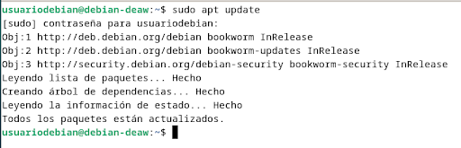

Se instala el paquete de nginx.  

Se comprueba que está bien instalado y se reinicia.  

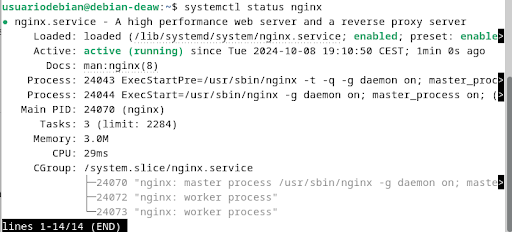

## Creación de las carpeta del sitio web
Se crea la carpeta donde se almacenará el sitio web con el comando sudo mkdir -p /var/www/nombre_web/html
y se clona el repositorio. Si da fallo por el git es porque hay que instalar su paquete.  

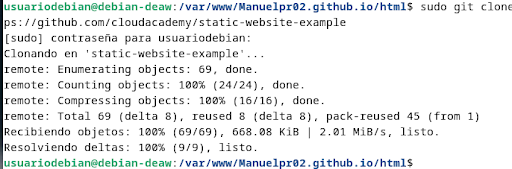

Se le da la propiedad de la carpeta al usuario del servicio web y se le dan los permisos.  

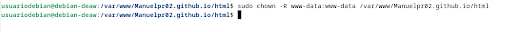

Se busca la ip para comprobar el funcionamiento.  

Desde Windows en este caso se comprueba que el servidor funciona.  

## Configuración de servidor web NGINX
Para configurar el servidor se modifican primero los archivos de los hots virtuales añadiendo las siguientes líneas.  

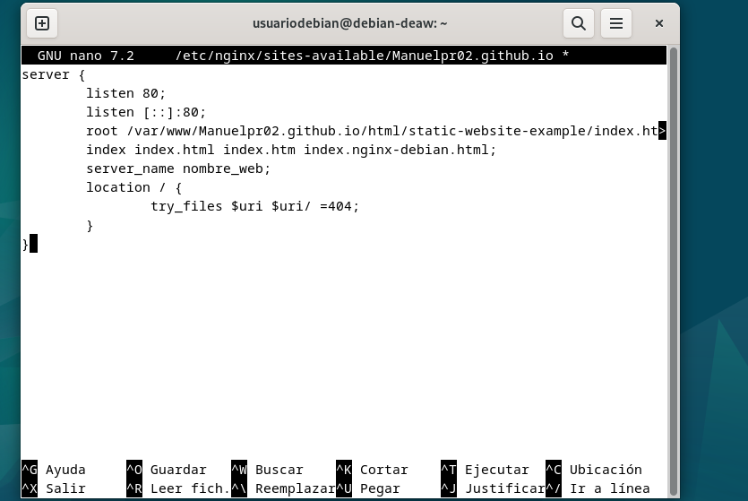

Y se crea el archivo simbólico entre los sitios habilitados y dicho artículo modificado.
Por último se reinicia para que se aplique la modificación.  

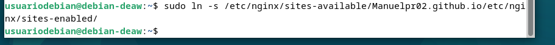

## Comprobaciones
### Comprobación del correcto funcionamiento
Lo primero es modificar el archivo hosts de Windows añadiendo la IP de la máquina virtual.  

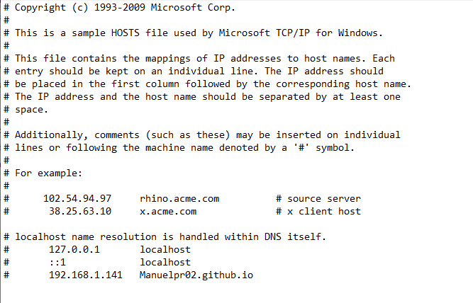

### Comprobar registros del servidor
Ahora se comprueban los archivos logs y sus rutas. Primero los de acceso:  

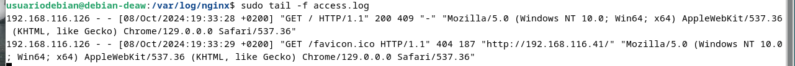

Y luego los de error:  

## FTP
### Configurar servidor SFTP en Debian
Primero se instala.  

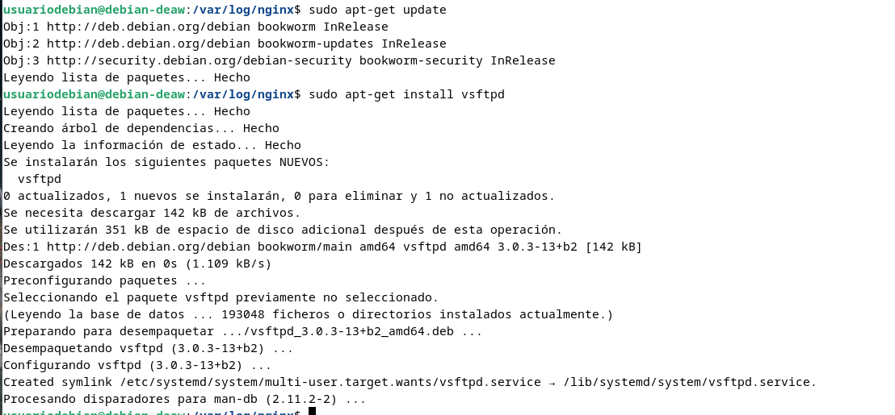

Se crea la carpeta para almacenarlo y los certificados de seguridad.  

Se modifica el fichero de configuración y se añaden las siguientes líneas.  

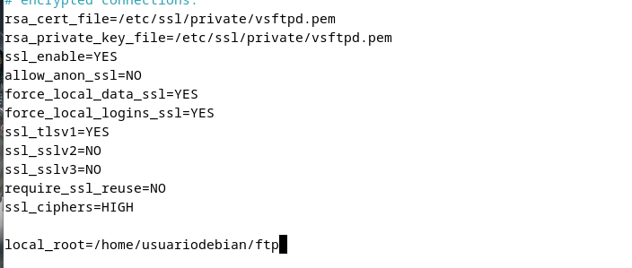

Ahora para la comprobación se descarga Filezilla en Windows y se introducen los datos de la máquina virtual y el puerto 21 y se le da a conexión rápida.  

Si se conecta saldrá los directorios de la máquina virtual en la derecha.  

Se clica en la carpeta descargas y se ve la conexión donde se sube algún archivo.  

Se descarga el paquete para descomprimir ZIP si no se tiene.  

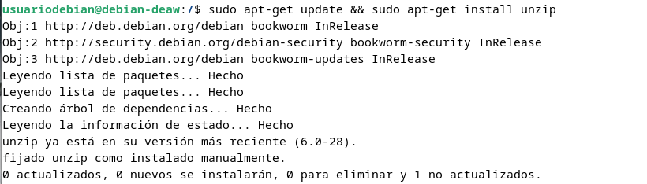

## HTTPS
Se genera el certificado SSL y la clave privada.  

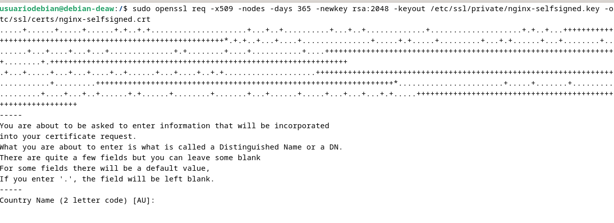

Se crea el fichero Diffie-Hellman.  

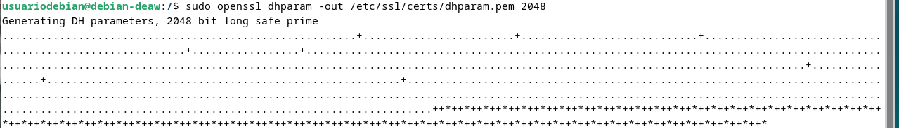

Se modifica añadiendo las siguientes líneas.  

Se crea otro archivo para dar más seguridad con las siguientes líneas.  

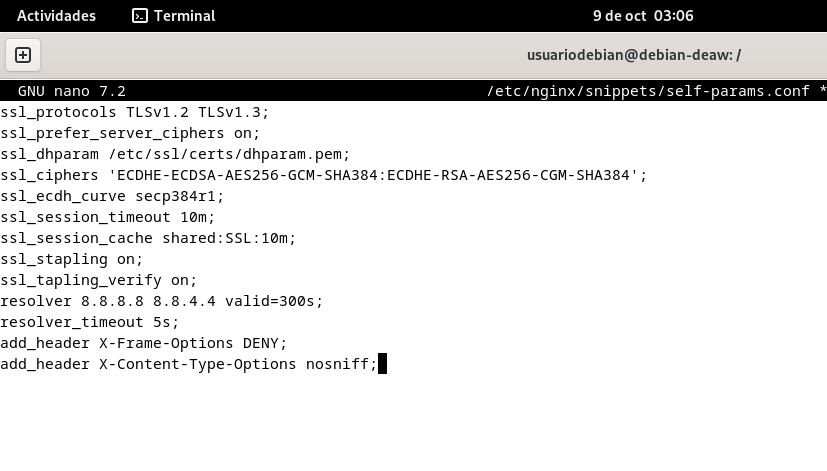

Por último se modifica el nginx para HTTPS con las siguientes líneas.  

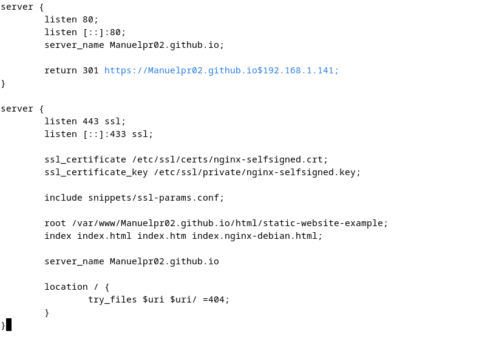

Se guarda el archivo y se reinicia.  

Se comprueban los ficheros de accesso y de error para visualizar la conexión.  

Por último se comprueba el funcionamiento desde Windows. Se pone HTTP:// y el dominio y se pulsa enter.  

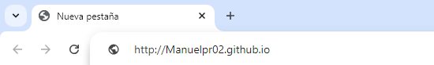

Se comprueba que lo redirecciona a HTTPS y funciona.  

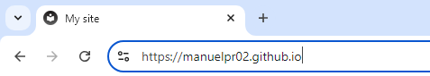

## Cuestiones finales

#### 1. ¿Qué pasa si no hago el link simbólico entre sites-available y sites-enabled de mi sitio web?

Si no haces el link simbólico, Nginx no sabrá que el sitio web está disponible para servir, y no se podrá acceder a él.

#### 2. ¿Qué pasa si no le doy los permisos adecuados a /var/www/nombre_web?

Sin los permisos adecuados, Nginx no podrá servir tu sitio web, y se expondrá a problemas de seguridad. 