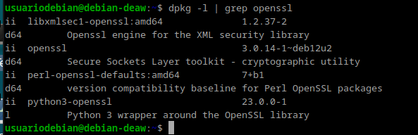
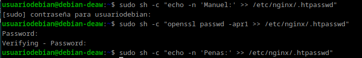
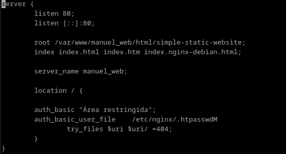
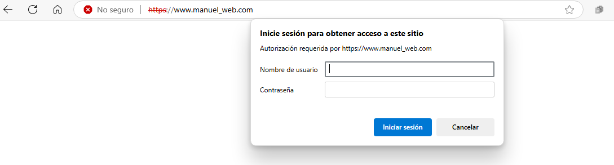
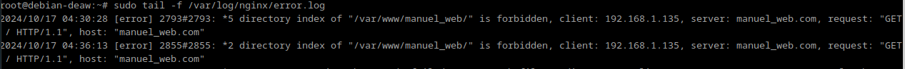
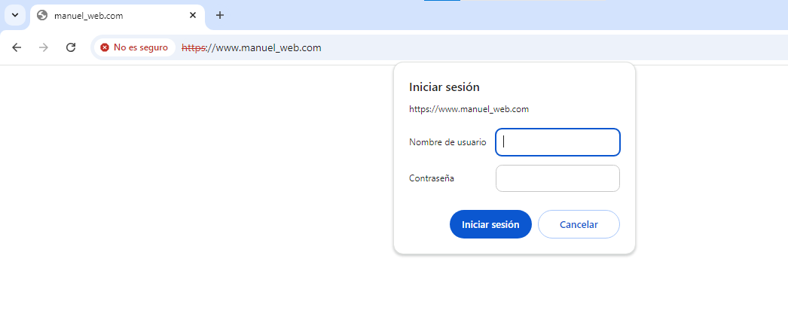

# Práctica 2.2 - Autenticación en un servidor web Nginx

## Paquetes necesarios

Primero se comprueba que esté el paquete openssl instalado.  

## Creación de usuarios y contraseñas
Se crea los dos usuarios, aunque mi apellido es Peñas lo he puesto sin ñ para evitar errores y se crea una contraseña cifrada.  

Se comprueba que esté correctamente cifrado.  

## Autentificación básica

Se modifica el fichero de configuración para que pida autentificación al acceder.  

## Comprobación

Como se puede comprobar pide usuario y contraseña al acceder. 

Este es el mensaje que se muestra si no introduces algún dato correcto.  

Aquí se pueden comprobar los accesos correctos y erróneos de antes.  

## Tareas
Ahora para pedir autentificación de una parte de la página lo hacemos con la parte contactos, modificamos el archivo de configuración para que la pida ahí.  

Como se puede observar te pide autentificación y al acceder muestra la página de contactos.  

## Tareas combinación autentificación y restricción por IP
Primero se busca la ip de Windows y luego en el archivo de antes se le deniega el acceso.  

Y esto es lo que sale al intentar acceder y en el fichero de error de acceso.  

Por último se permite el acceso a una ip y se bloquea a las demás y se verifica que se puede acceder.  

## Cuestiones finales
#### Supongamos que yo soy el cliente con la IP 172.1.10.15 e intento acceder al directorio web_muy_guay de mi sitio web, equivocándome al poner el usuario y contraseña. ¿Podré acceder?¿Por qué?  

No podrás acceder porque la directiva satisfy all, obliga a que tanto la autentificación como la IP deben ser correctas. Y en este caso aunque esa IP sí este permitida el usuario sería erróneo  

#### ask "Cuestión 1" Supongamos que yo soy el cliente con la IP 172.1.10.15 e intento acceder al directorio web_muy_guay de mi sitio web, introduciendo correctamente usuari y contraseña. ¿Podré acceder?¿Por qué?  

En este caso sí podrás acceder porque se cumple que tanto la IP como la autentificación son correctos.  
#### Supongamos que yo soy el cliente con la IP 172.1.10.15 e intento acceder al directorio web_muy_guay de mi sitio web, introduciendo correctamente usuario y contraseña. ¿Podré acceder?¿Por qué?  

En este caso no podrás acceder porque la directiva any sólo permite que se cumpla una de las dos condiciones y en este caso tanto la IP como la autentificación son correctos.  

#### A lo mejor no sabéis que tengo una web para documentar todas mis excursiones espaciales con Jeff, es esta: Jeff Bezos y yo.  Supongamos que quiero restringir el acceso al directorio de proyectos porque es muy secreto, eso quiere decir añadir autenticación básica a la URL:Proyecto. Completa la configuración para conseguirlo:  

server {
    listen 80;
    listen [::]:80;
    root /var/www/freewebsitetemplates.com/preview/space-science;
    index index.html index.htm index.nginx-debian.html;
    server_name freewebsitetemplates.com www.freewebsitetemplates.com;

    location /Projects {
        auth_basic "Acceso restringido";
        auth_basic_user_file /etc/nginx/.htpasswd; 
        
        try_files $uri $uri/ =404;
    }
}

Se le añade la localización de los proyectos y se indica la autentificación  
