# Práctica 2.3 – Proxy inverso con Nginx

Primero se clona la máquina generando nuevas direcciones MAC.  
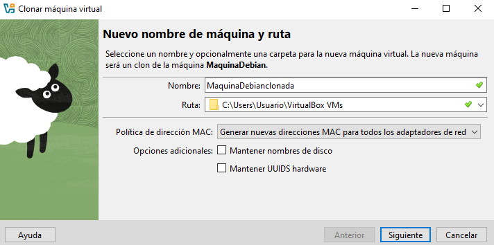
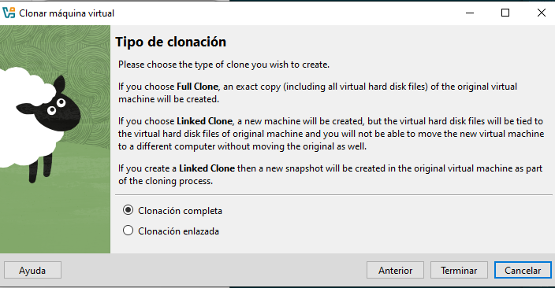
 
En la máquina donde estaba el servidor se le cambia el nombre a webserver al archivo de configuración, se le cambia el puerto por el 8080 y se le añade un header para la futura comprobación.  
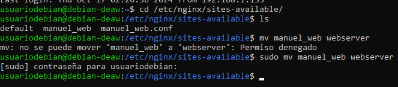

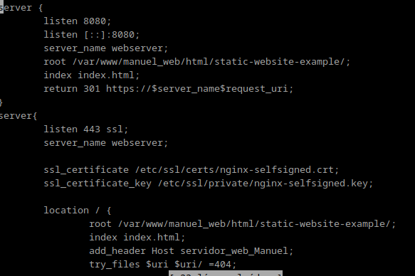
Finalmente se elimina el enlace simbólico que había y se crea uno nuevo, luego se reinicia nginx.
 
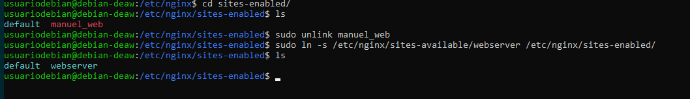
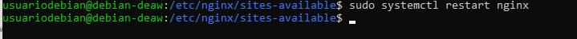
En el hosts de Windows se cambia la IP por la nueva máquina que va a hacer de proxy y se cambia el nombre.
 
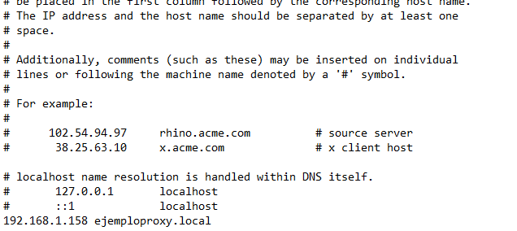
Se crea un fichero de archivo nuevo donde se mantiene el puerto 80, el nombre se le asigna el del hosts y en location se le añade un header y la dirección donde se redirige.
 
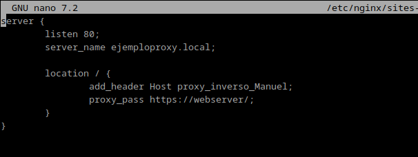
También se le añade al hosts de la máquina con la ip del servidor.
 
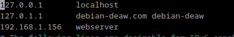 
 
Por último se comprueba buscando en Firefox, pulsando F12, en red desactivando la caché y pulsando en el primero. Y en las cabeceras se ve ambos header antes añadidos. También se comprueba el access.log para verificar que se han conectado.
 
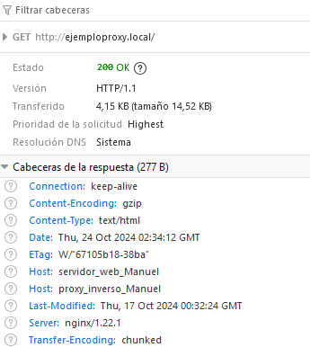
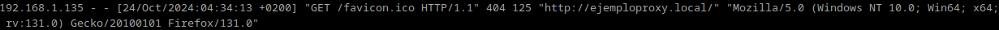