# Práctica 2.4 – Balanceo de carga con proxy inverso en Nginx

## Pasos iniciales
Lo primero es eliminar los dos enlaces simbólicos de ambas máquinas.  
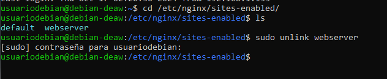
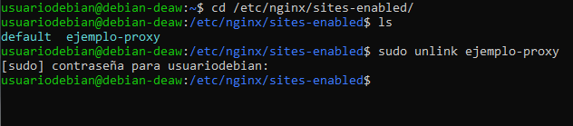
## Nginx Servidor Web 1
Se crea el index.html para el servidor original en la ruta /var/www/manuel_web/html.  
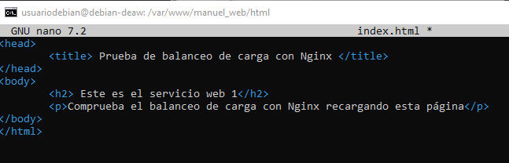
Se modifica el nombre a webserver1 y se le cambia la ruta para que coja el html. Se le añade también la cabecera de servidor1, se crea el enlace simbólico nuevo como en las prácticas pasadas y se reinicia nginx.  
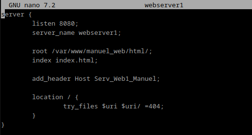

## Nginx Servidor Web 2
Primero se clona la máquina virtual del servidor web 1.  
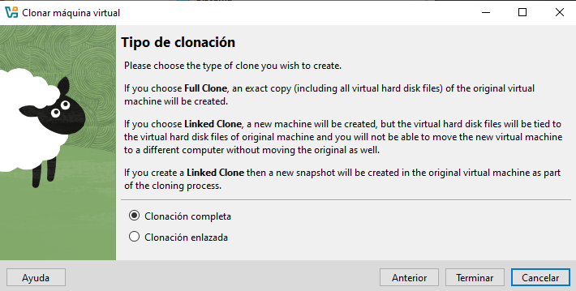
Se modifica todo lo que venía de webserver1 por el 2 incluida la cabecera e index.html. Se crea el enlace simbólico y se reinicia nginx y ya estarían creados ambos servidores.  
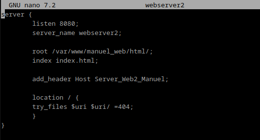
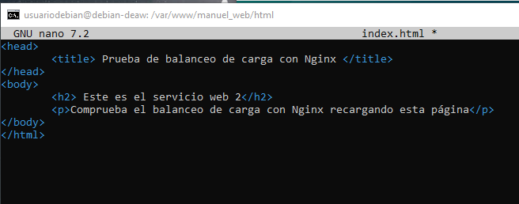
## Nginx Proxy Inverso
Se crea un nuevo fichero de configuración llamado balanceo, se añade lo siguiente añadiendo las ip y sus puertos de los dos servidores web, el nombre de este proxy nuevo y la dirección que redirige.  
  upstream backend_hosts {
                random;
                server ________:____;
                server ________:____;
    }
            server {
                listen 80;
                server_name ________;      
                location / {
                    proxy_pass http://backend_hosts;
                }
            }  
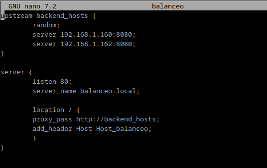

Se añade las ip al fichero hosts de está maquina y al de la máquina anfitriona.  
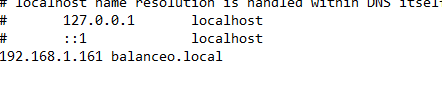
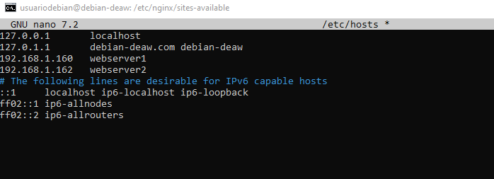
## Comprobaciones
Por último se comprueba ejecutando http://balanceo.local y el random de antes hace que de forma aleatoria unas veces se envíe a un servidor o otro. Aquí se puede ver con sus cabeceras.  
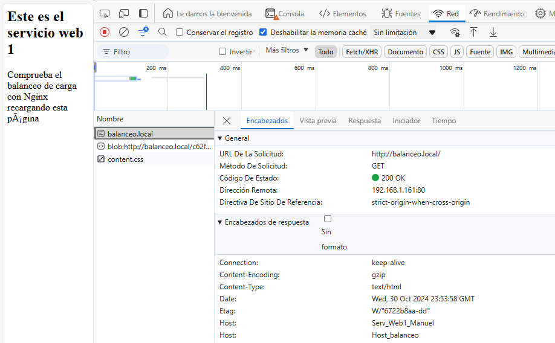
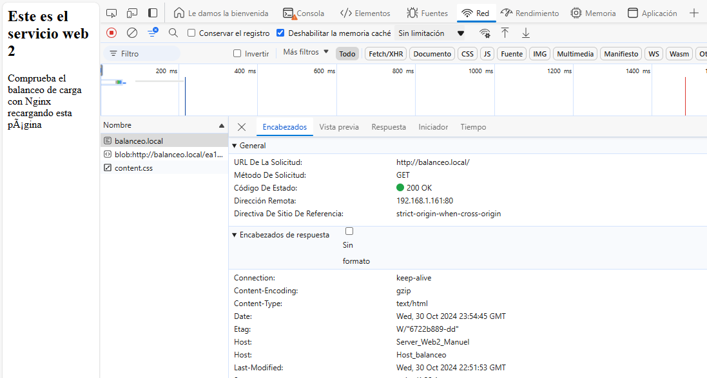
En el caso de apagar el 2 por ejemplo pues sigue mandándolo al que queda vivo que es el 1 en este caso.  
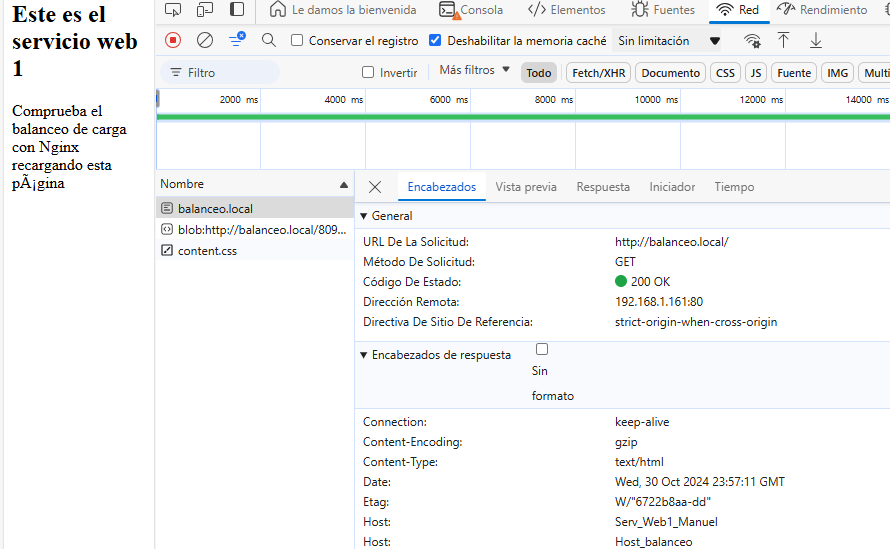
## Cuestiones Finales

#### Cuestión 1. Busca información de qué otros métodos de balanceo se pueden aplicar con Nginx y describe al menos 3 de ellos.

IP Hash: Este método utiliza la dirección IP del cliente para determinar a qué servidor de back-end se asignará la solicitud. Esto garantiza que un usuario específico siempre sea dirigido al mismo servidor, lo cual es útil en casos donde se desea mantener la persistencia de sesión (session affinity). 

Round Robin: Este es el método predeterminado y asigna las solicitudes a los servidores de back-end de forma secuencial. Cada solicitud se envía al siguiente servidor en la lista, distribuyendo la carga uniformemente entre todos los servidores. Si uno de los servidores falla, Nginx simplemente lo omite y pasa al siguiente servidor disponible.

Least Connections: Este método envía la solicitud al servidor con la menor cantidad de conexiones activas. Es ideal en situaciones donde el tiempo de procesamiento de las solicitudes puede variar, ya que ayuda a evitar la sobrecarga de un servidor con demasiadas conexiones.  

#### Cuestión 2. Si quiero añadir 2 servidores web más al balanceo de carga, describe detalladamente qué configuración habría que añadir y dónde.
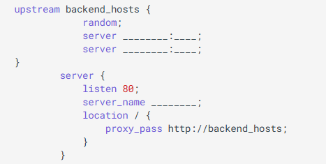
En ese bloque se añadirían en el upstream los dos servidores nuevos con su IP y puerto y en el fichero hosts igual.  
#### Cuestión 3. Describe todos los pasos que deberíamos seguir y configurar para realizar el balanceo de carga con una de las webs de prácticas anteriores.

Indicad la configuración de todas las máquinas (webservers, proxy...) y de sus servicios
Lo primero sería crear un fichero index.html igual en la misma ruta de dicha máquina pero indicando que es el servidor 3. Luego se crearía el fichero de configuración igual llamado webserver3 e indicando la nueva cabecera también. Se crearía el enlace simbólico y se reinicia Nginx.

Por último en el servidor de balanceo se añade el nuevo servidor en el archivo del apartado anterior y se añade la ip al fichero hosts