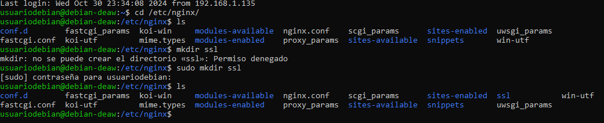
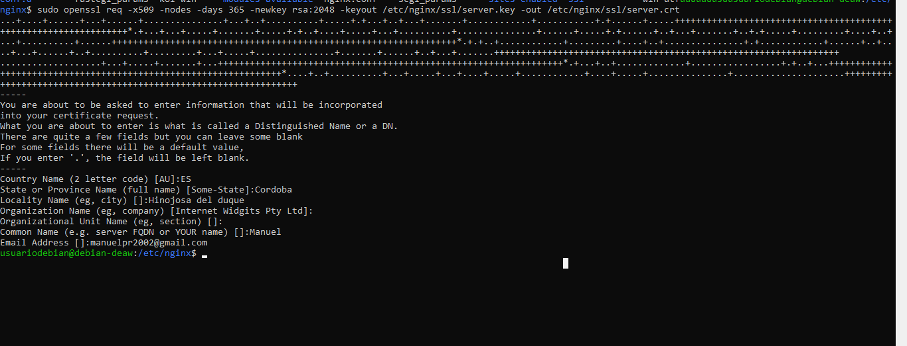
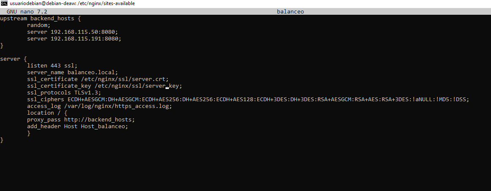
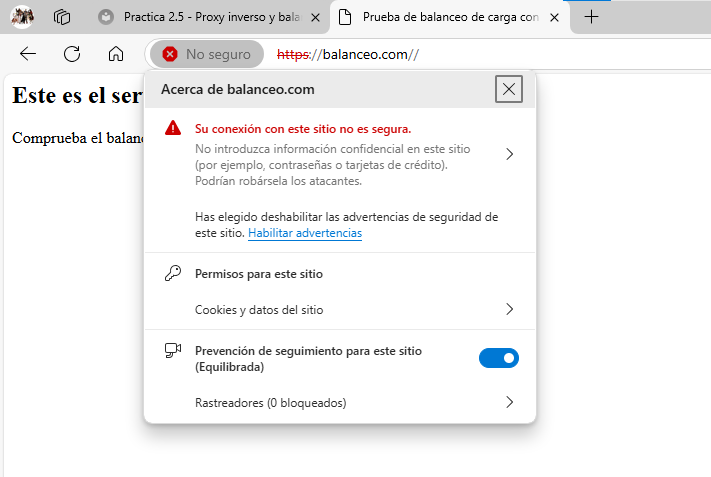
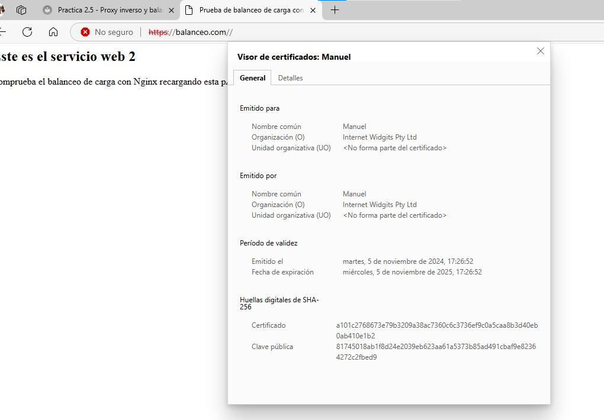
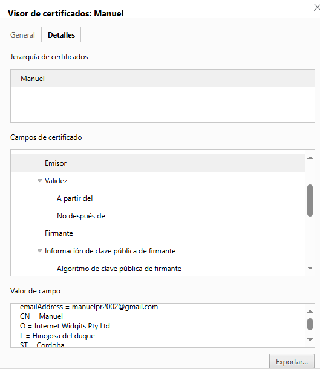
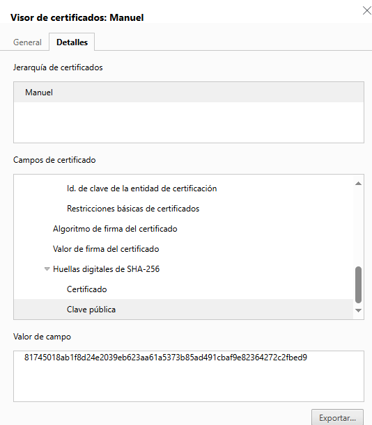
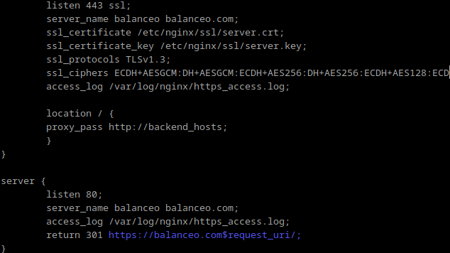
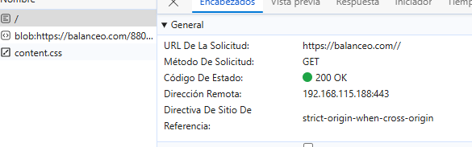

# Practica 2.5 - Proxy inverso y balanceo de carga con SSL en NGINX

## Creación de certificado autofirmado
Lo primero es crear la carpeta ssl donde se guardará los certificados y será en /etc/nginx .  

Luego se creará el certificado con el comando de la imagen y se rellenan los datos.  

## Configuración SSL en el proxy inverso
Se modifica el archivo de configuración cambiendo el puerto de escucha, añadiendo las líneas de certificados y se cambia la ruta del access.log .  

## Comprobaciones
Se accede a la dirección y salta el aviso de que no es seguro, se accede igualmente y se comprueba el certificado.  

Se miran los detalles y se comprueba que son los datos creados antes.  

## Redirección forzosa a HTTPS
Se le añade la siguiente configuración para forzar que use https siempre que se acceda.  

Si se le quita el puerto 80 se comprueba que sigue accediendo igualmente por https.  

## Cuestiones finales
#### Cuestión 1.

Lo primero es comprobar las rutas y que los permisos son correctos, para este caso posiblemente las instrucciones a dar son: 
sudo chown www-data:www-data /etc/nginx/ssl/enrico-berlinguer/server.

sudo chmod 600 /etc/nginx/ssl/enrico-berlinguer/server.

Algunos navegadores y clientes más antiguos no son compatibles con TLSv1.3, por lo tanto hay que agregar TLSv1.2 como protocolo adicional para asegurar la compatibilidad.

Hay que comprobar que la línea server_name enrico-berlinguer coincida con el dominio o la IP que estás usando para acceder al sitio.  

#### Cuestión 2.
Esto indica que el certificado SSL del sitio web ha sido revocado por la autoridad de certificación.
Lo primero que se puede hacer es intentar uno generar uno nuevo o contactar con la autoridad para saber el motivo del revocamiento. Después se instala el nuevo certificado actualizando Nginx y sustituyendo las rutas del anterior por la del nuevo. Si el revocado sigue en uso hay que eliminarlo para poder instalar el nuevo, comprobando la caché del navegador porque a veces se queda ahí guardado.