# Práctica 3.1: Instalación de Tomcat
## Instalación de Tomcat
Lo primero es instalar el jdk y tomcat en su versión 10. <br>
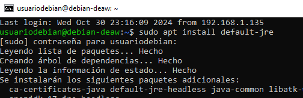
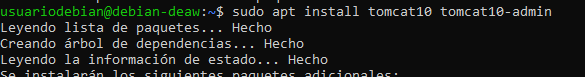
## Despliegue manual mediante la GUI de administración
Para desplegarlo se crea los usuarios de registro. <br>
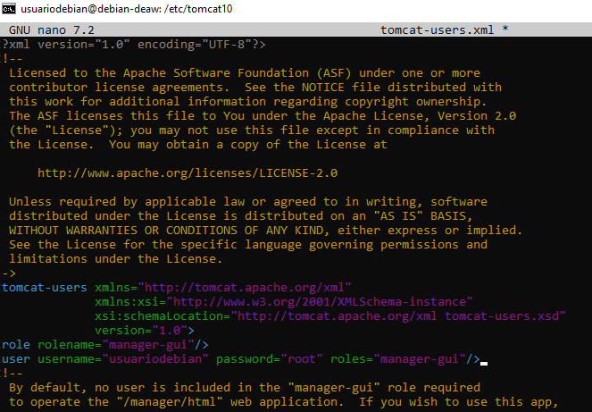
Se accede desde la url de la captura iniciando sesión con los datos de antes. <br>
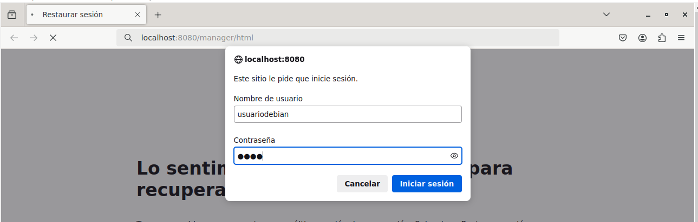
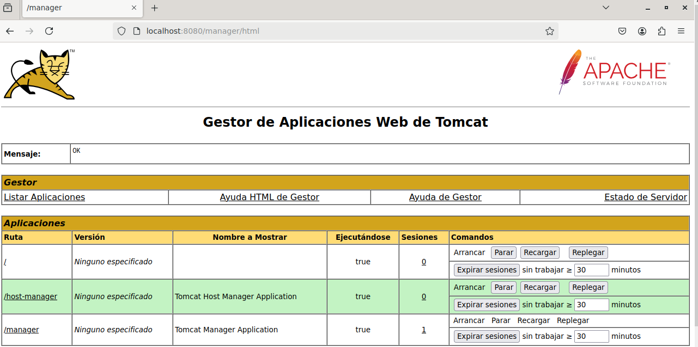
En la siguiente sección se le da a browse y se selecciona el .war y se ejecuta luego y se muestra el contenido del archivo. <br>
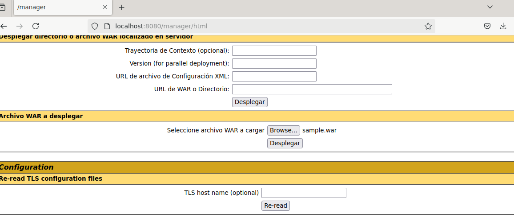
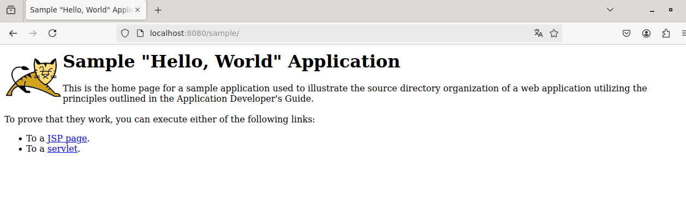
## Despliegue con Maven
Ahora se instala maven con los siguientes comandos y se comprueba la versión. <br>
sudo apt update <br>
sudo apt install maven
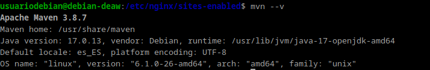
## Configuración de Maven
Ahora se configura con un nuevo usuario y sus roles.
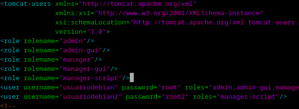
En el archivo /etc/maven/settings.xml se le añade los siguiente. <br>
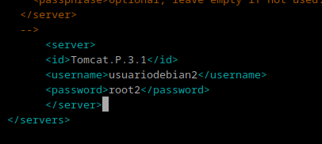 <br>
Y luego en el pom.xml del proyecto. <br>
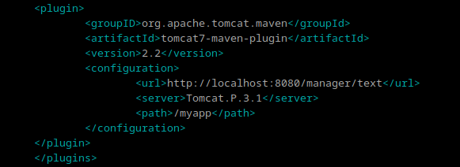
## Despliegue
Para desplegarlo se crea la aplicación de Java con el siguiente comando y se despliega. <br>
mvn archetype:generate -DgroupId=usuariodebian -DartifactId=war-deploy -DarchetypeArtifactId=maven-archetype-webapp -DinteractiveMode=false <br>

mvn tomcat7:deploy <br>
Se comprueba que se ha desplegado
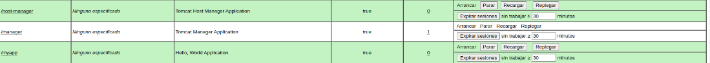
## Tarea
Se clona el repositorio y se modifica el pom.xml añadiendo el bloque ```<plugin>...</plugin>``` y se comprueba el resultado. <br>
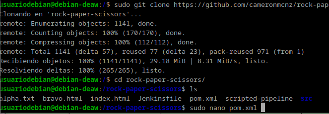
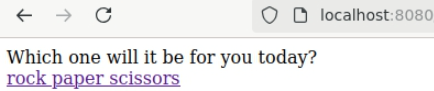 <br>
## Cuestiones. Habéis visto que los archivos de configuración que hemos tocado contienen contraseñas en texto plano, por lo que cualquiera con acceso a ellos obtendría las credenciales de nuestras herramientas.

En principio esto representa un gran riesgo de seguridad, ¿sabrías razonar o averigüar por qué esto está diseñado de esta forma?
Almacenar contraseñas en texto plano en archivos de configuración es inseguro, pero se hace a veces por razones prácticas: facilita el acceso rápido en desarrollo, es compatible con herramientas antiguas, y puede mejorar el rendimiento en sistemas cerrados y de baja seguridad. Sin embargo, en entornos de producción, es mejor usar alternativas más seguras, como cifrado o gestores de secretos, para proteger las credenciales.