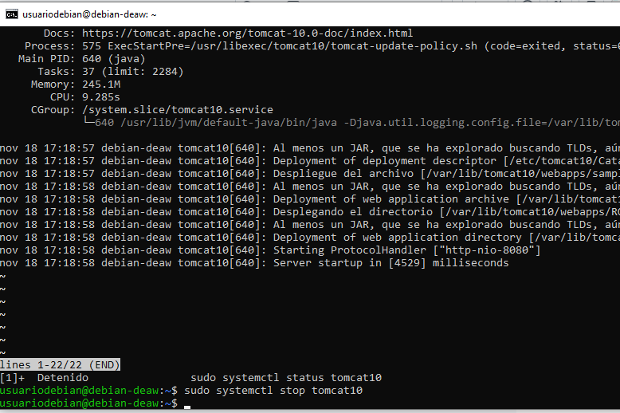
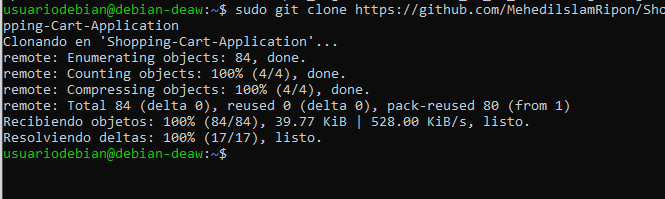
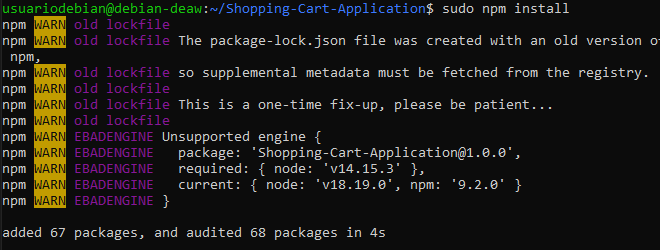
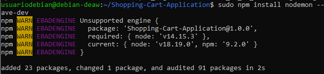
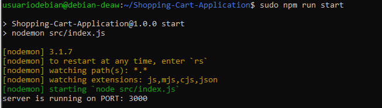
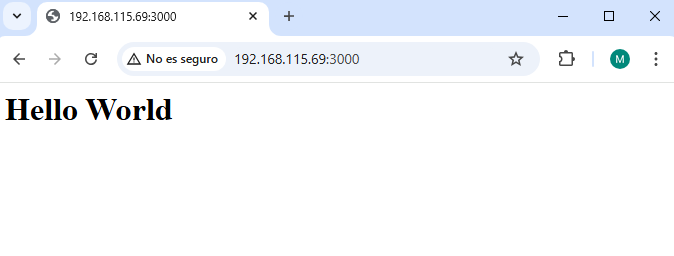

# Práctica 3.2 - Despliegue de aplicaciones con Node Express

## Instalación de Node.js, Express y test de la primera aplicación
Lo primero es parar tomcat si estaba en proceso e instalar Node con el comando sudo apt -y install nodejs npm.  

Luego se clona el repositorio de la foto y se accede a el.  

## Despliegue de una nueva aplicación
Para desplegarlo primero se instalan las librerías necesarias dentro del propio proyecto.  

Se ejecuta el comando de la imagen para que no de fallos.  

Se ejecuta con npm run start.  

Y como se puede ver se despliega usando la ip de la máquina y el puerto 3000 que usa por defecto.  

## Cuestiones
#### Cuando ejecutáis el comando npm run start, lo que estáis haciendo es ejecutar un script:
#### ¿Donde podemos ver que script se está ejecutando?
Se puede ver el script que se ejecuta en la sección scripts del archivo package.json. Este archivo se encuentra en el directorio raíz del proyecto.
Ejemplo:
{
  "scripts": {
    "start": "node server.js",
    "test": "jest"
  }
}
 

#### ¿Qué comando está ejecutando?
node server.js