# Enunciado ejercicios Git y GitHub I y II

## Repositorio DEAW
Lo primero es crear el repositorio público en Github con el nombre de DEAW.  
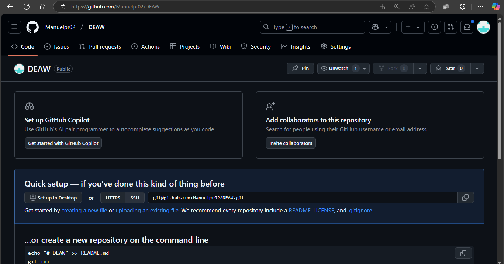  
Se clona dentro de una carpeta.  
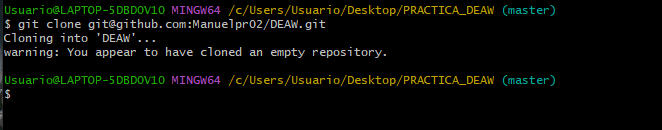  
## README
Se crea un README.md con contenido.  
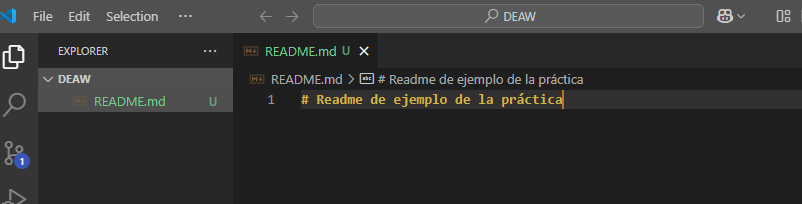 
## Commit inicial
Se crea el commit para la subida.  
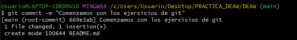 
## Push inicial
Se sube al repositorio con git push y se comprueba como se ha subido.  
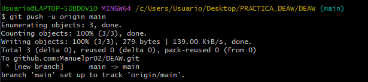  
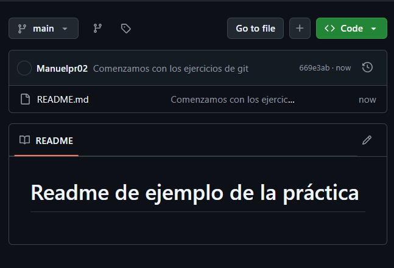  
## Ignorar archivos
Se crea un fichero privado.txt y una carpeta llamada privada y se añade dentro del .gitignore para que lo ignore.  
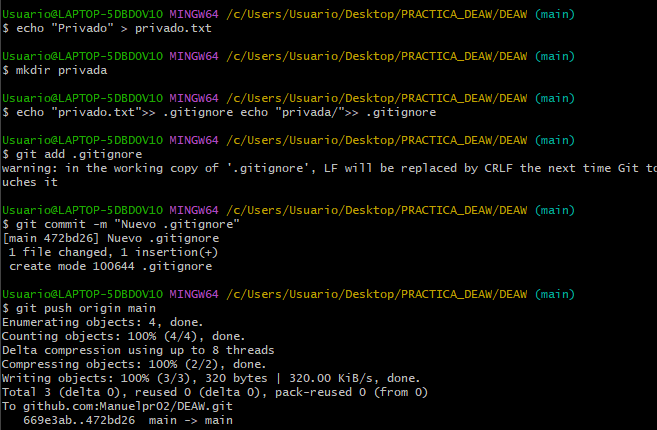  
Se sube y se comprueba que no se hayan subido el fichero y la carpeta.  
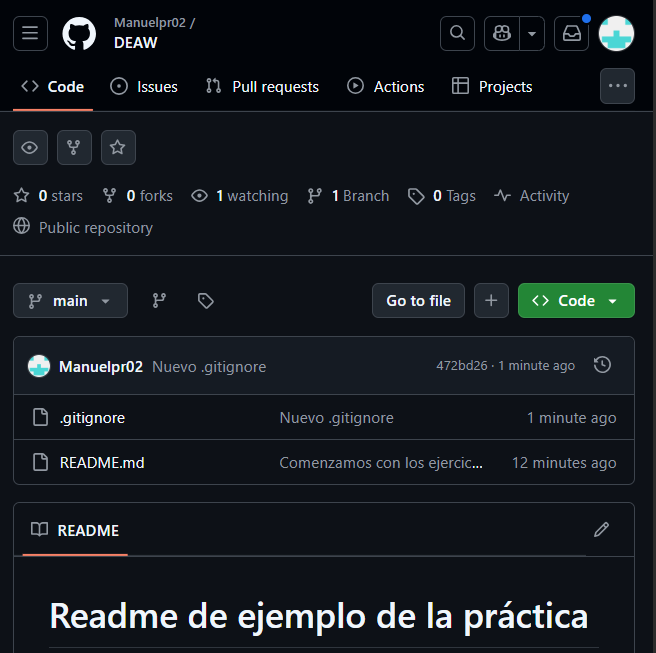  
## Añadir fichero 1.txt
Se crea un fichero 1.txt y se añade con git add.  
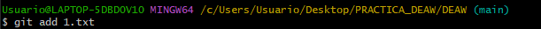  
## Crear el tag v0.1
Se crea un tag con git tag y se añade.  
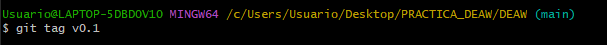  
## Subir el tag v0.1
Se sube con git push el tag.  
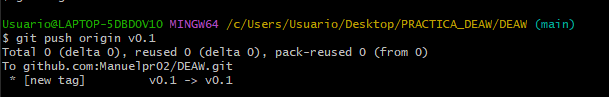  
## Cuenta de GitHub
Se cambia la foto de perfil dentro del propio Github y se añade la doble autentificación.  
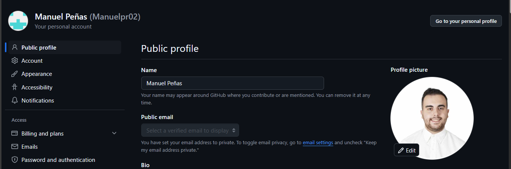  
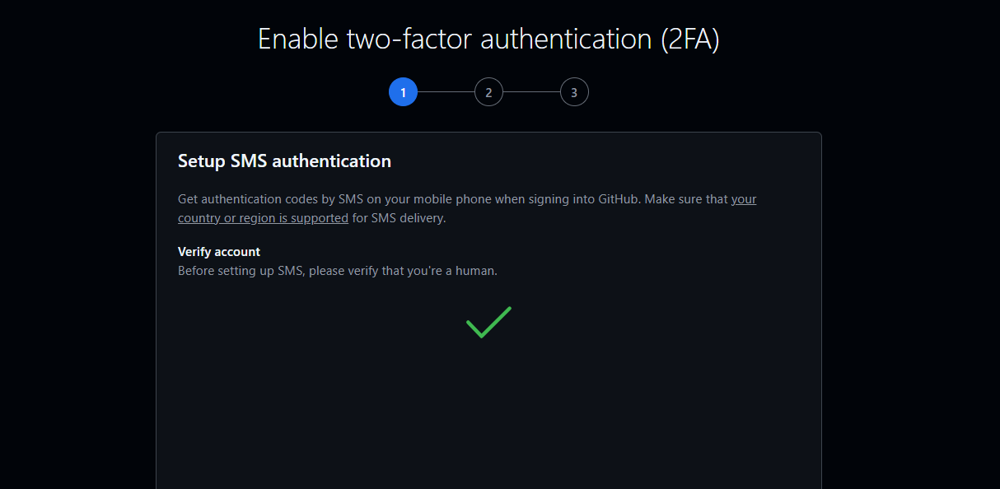  
## Crear una tabla
Se modifica el Readme añadiendo nuevos usuarios y su correo y se sube.  
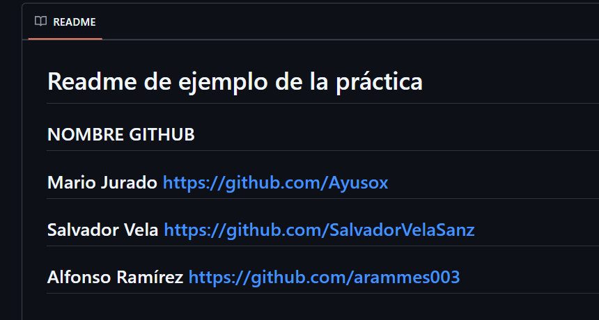  
## Colaboradores 
Se invita como colaborador a un usuario dentro de Github.  
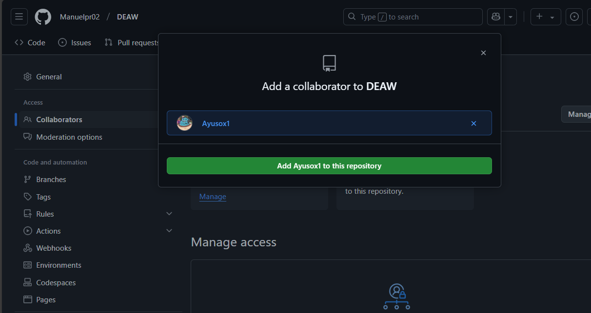  
## Crear una rama v0.2
Se crea una rama con git branch.  
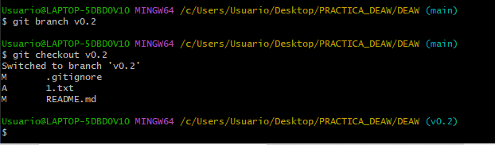  
## Añadir fichero 2.txt
Se crea un fichero 2.txt y se sube al repositorio y se comprueba su subida.  
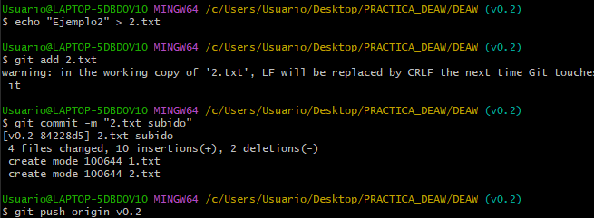  
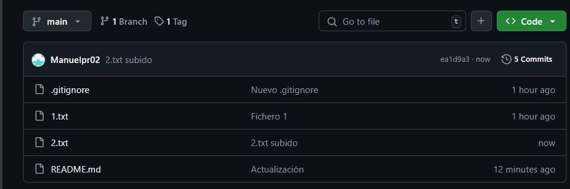  
## Merge directo
Se cambia a la rama main y se hace un merge llamado v0.2 .  
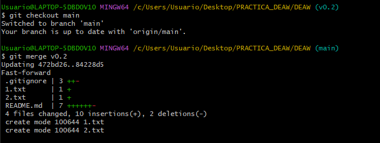  
## Merge con conflicto
Se modifica los ficheros creados antes poniendo hola y adiós y se suben y se fusionan las ramas.  
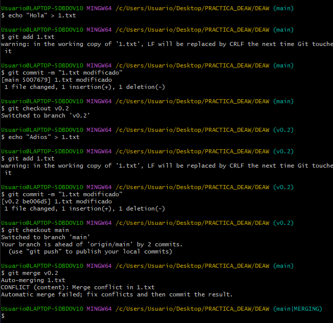  
## Listado de ramas
Se muestra las ramas con git branch.  
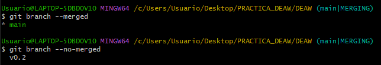  
## Arreglar conflicto
Se modifica el fichero y se añade solucionando el conflicto.   
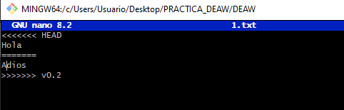   
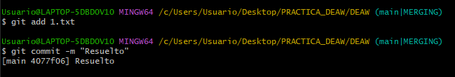   
## Borrar rama
Ahora se crea el tag v0.2 y se sube.   
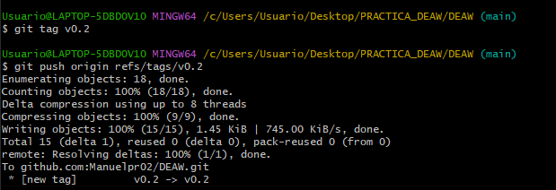   
Y luego se elimina la rama v0.2.   
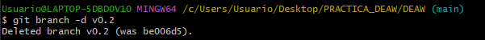   
## Listado de cambios
Se muestran todos los cambios con git log --oneline --decorate -graph -all.   
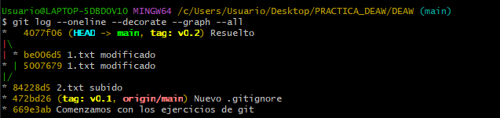   

## Ejercicios de creación y actualización de repositorios
#### Ejercicio 1
Se configura Git aladiendo usuario, el correo y activando el color de salida.   
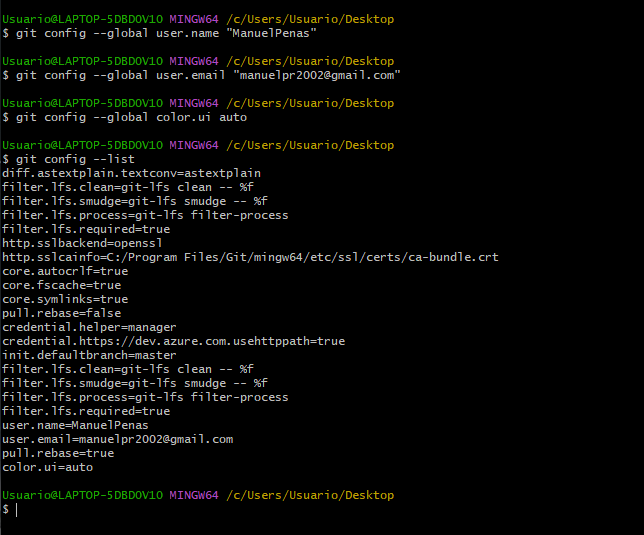   
#### Ejercicio 2
Se crea el repositorio libro y se muestra el contenido.   
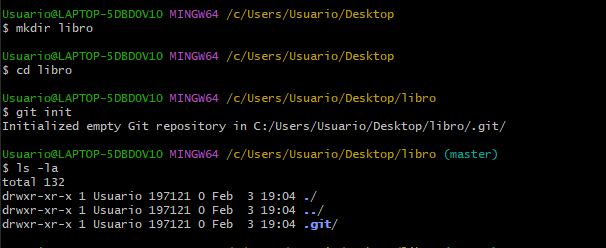   
#### Ejercicio 3
Se crea indice.txt con la información de la imagen y se sube a la zona de intercambio temporal.   
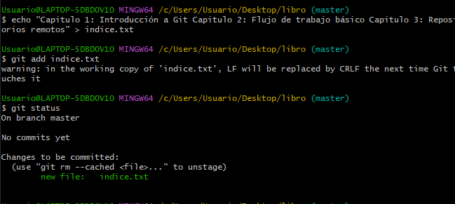   
#### Ejercicio 4
Se realiza el commit de la imagen y se sube.   
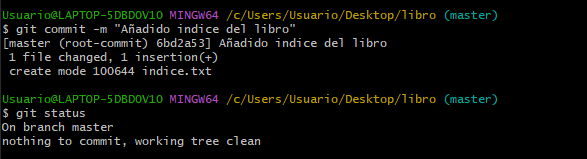   
#### Ejercicio 5
Se modifica el fichero de antes con la nueva información y se muestran las diferencias con la versión anterior. Luego se hace el commit.   
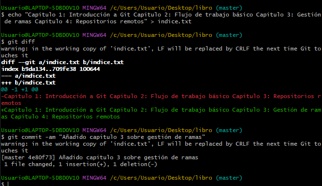   
#### Ejercicio 6
Se muestra los cambios con la versión anterior, se modifica el mensaje del commit y se vuelven a mostrar los cambios.   
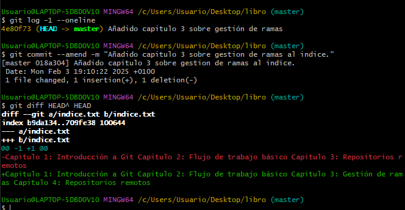   
## Ejercicios de manejo del historial de cambios
#### Ejercicio 1
Se muestra el historial de cambios, se crea la carpeta capitulos y dentro el fichero capitulo1.txt con la información de la imagen de debajo. Finalmente se hace el commit y se muestra el historial.  
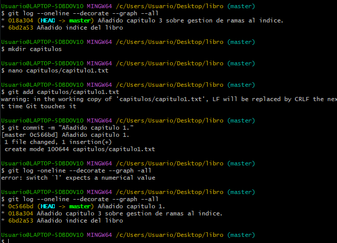  
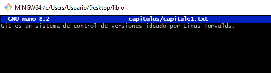  
#### Ejercicio 2
Se crea el fichero capitulo2.txt con la información de debajo, se sube, se crea el commit y se muestra la diferencia entre esta versión y dos anteriores.  
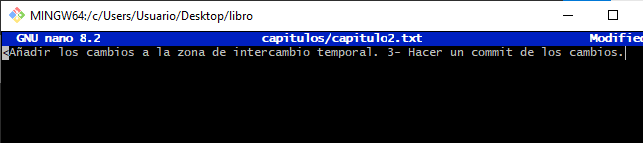  
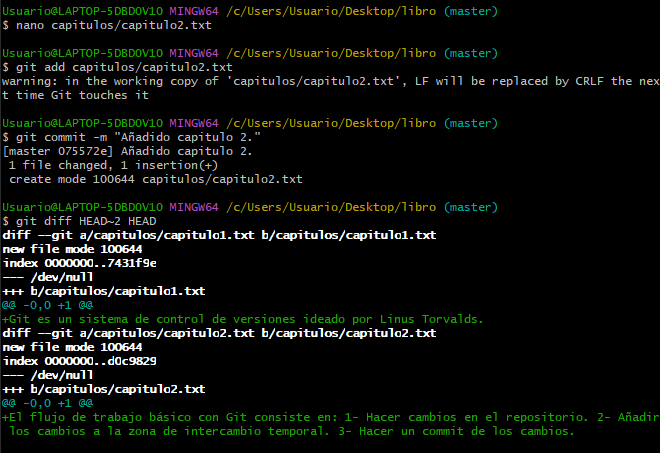  
#### Ejercicio 3
Se crea el fichero capitulo3.txt con la información de debajo se sube sube, se hace el commit y se muestra la diferencia entre la primera y última versión.  
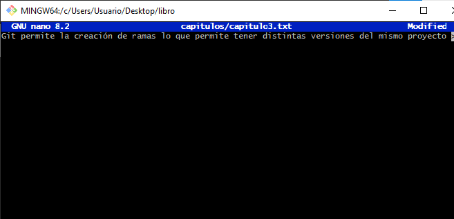  
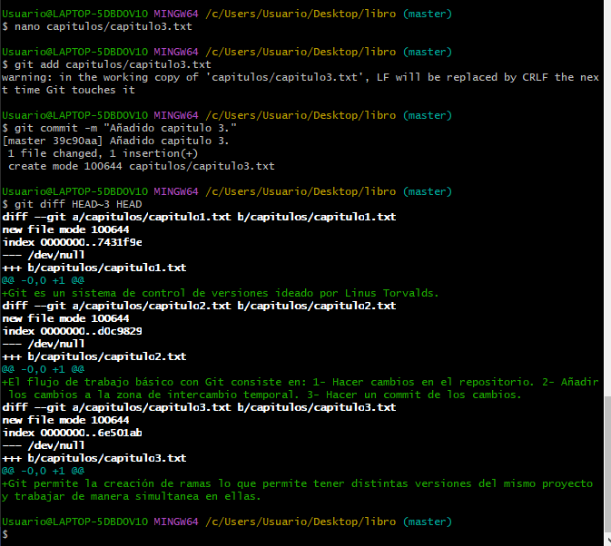  
#### Ejercicio 4
Se modifica indice.txt añadiendo la nueva línea, se crea el commit y se comprueba quien lo ha modificado con git blame.  
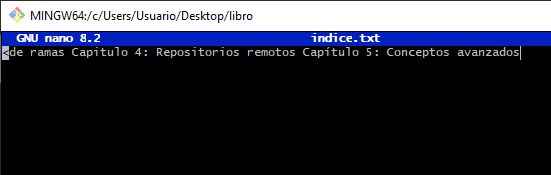  
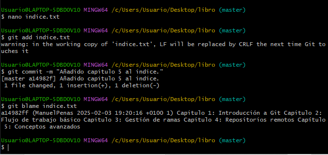  
## Ejercicios de deshacer cambios
#### Ejercicio 1
Se elimina la última linea de indice.txt se comprueba el estado y se vuelve a la versión anterior con git restore.  
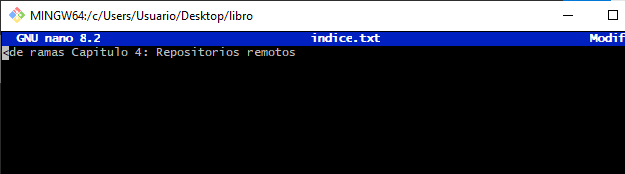  
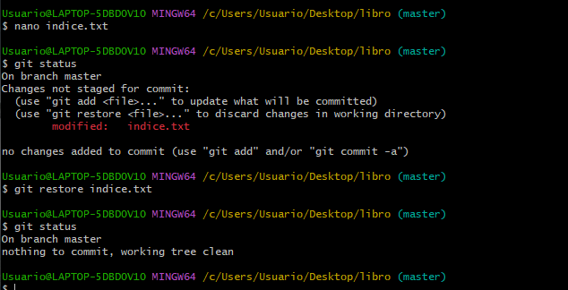  
#### Ejercicio 2
Se elimina la última línea de indice.txt, se sube, se comprueba el estado del repositorio, se quitan los cambios de la zona de intercambio temporal, se comprueba el estado y se vuelve a la versión original.  
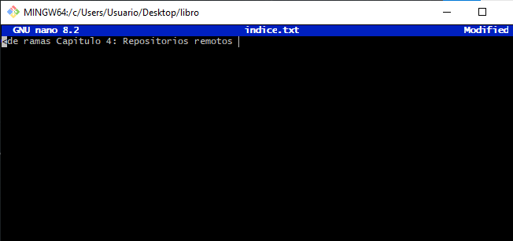  
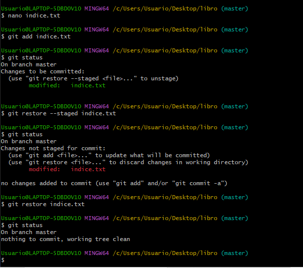  
#### Ejercicio 3
Se elimina la última linea de indice.txt, se guarda, se elimina el fichero capitulo3.txt, se añade uno nuevo llamado capitulo4.txt y se sube, se comprueba estado y se vuelve a la versión original.  
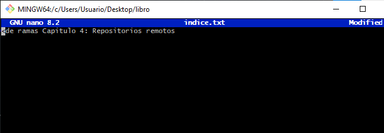  
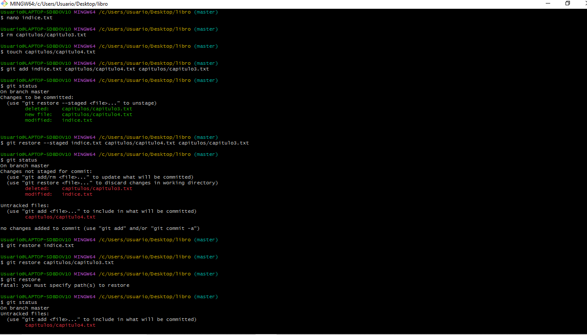  
#### Ejercicio 4
Se elimina la última línea de indice.txt, se elimina el fichero capitulo3.txt y se sube con el commit de la imagen, se comprueba el estado y se deshacen los cambios y se vuelve a hacer el mismo commit. Se vuelven a deshacer los cambios y se comprueba el historial y el estado.  
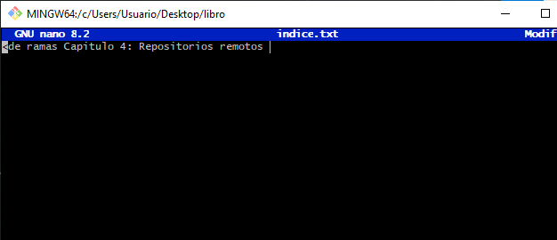  
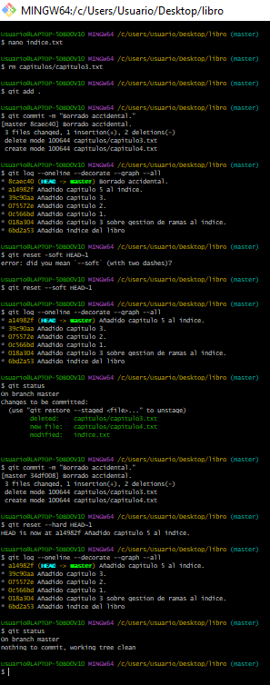  
## Ejercicios de gestión de ramas
#### Ejercicio 1
Se crea la rama bibliografía y se muestran las ramas existentes.  
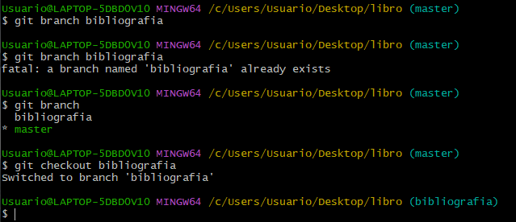  
#### Ejercicio 2
Se crea el fichero capitulo4.txt con la información de debajo y se sube a la zona de intercambio temporal haciendo el commit y mostrando el historial.  
  
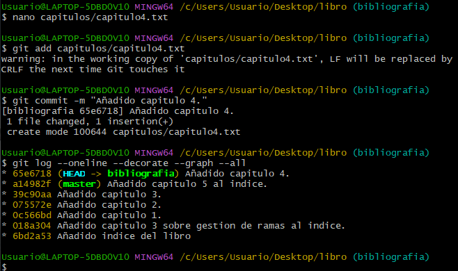  
#### Ejercicio 3
Se cambia a la rama creada antes y se crea el fichero bibliografía.txt con la información de debajo y se sube haciendo el commit y mostrando el historial.  
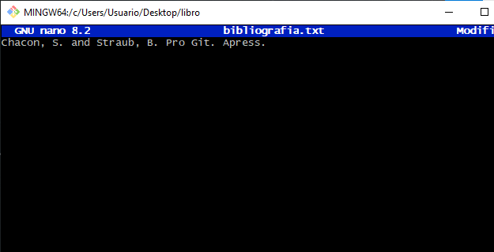  
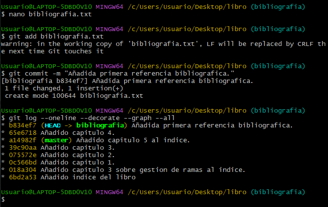  
#### Ejercicio 4
Se fusiona con la rama master, luego se muestra el historial, se elimina la rama bibliografía y se muestra el historial de nuevo.  
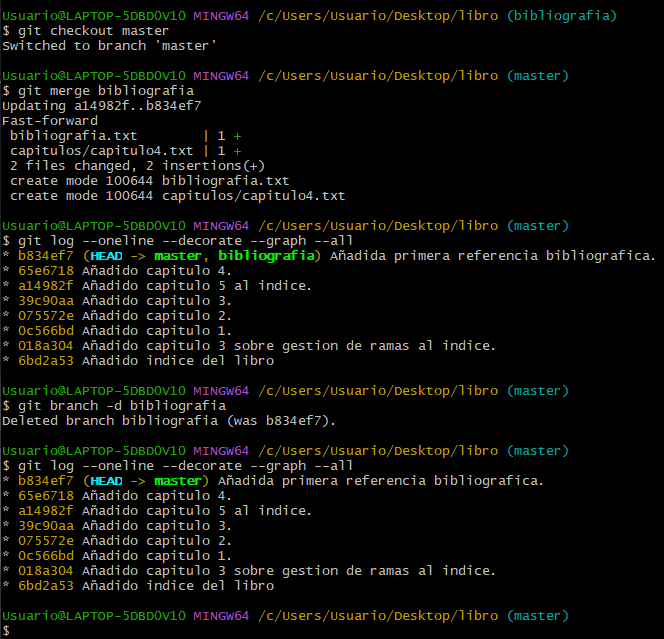  
#### Ejercicio 5
Se crea la rama bibliografía y se cambia modificando el fichero como en la segunda imagen de debajo, se añaden los cambios con el commit y se cambia a la rama master donde se modifica el mismo fichero como en la tercera imagen. Por último se fusionan las ramas y se modifica el conflicto como en la cuarta imagen y se sube haciendo el commit y mostrando el historial por último.  
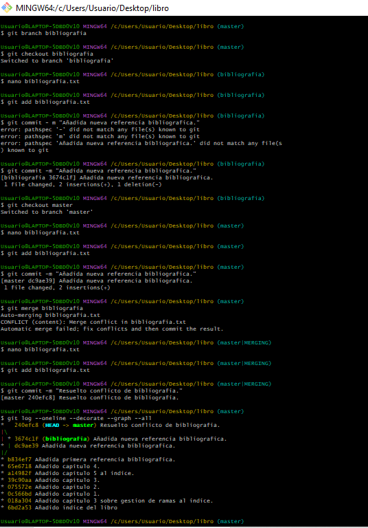  
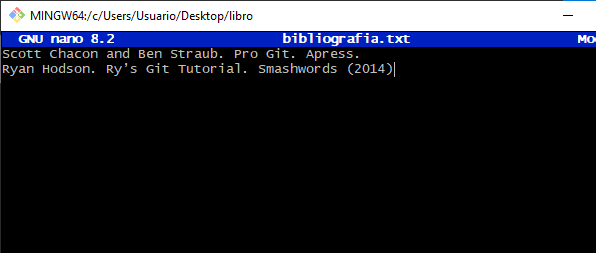  
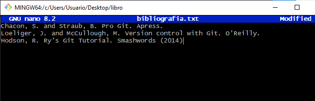  
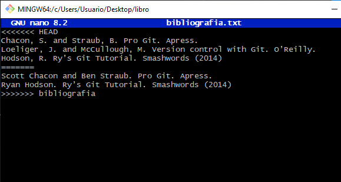  
## Ejercicios de repositorios remotos
#### Ejercicio 1
Se crea el nuevo repositorio en GitHub.  
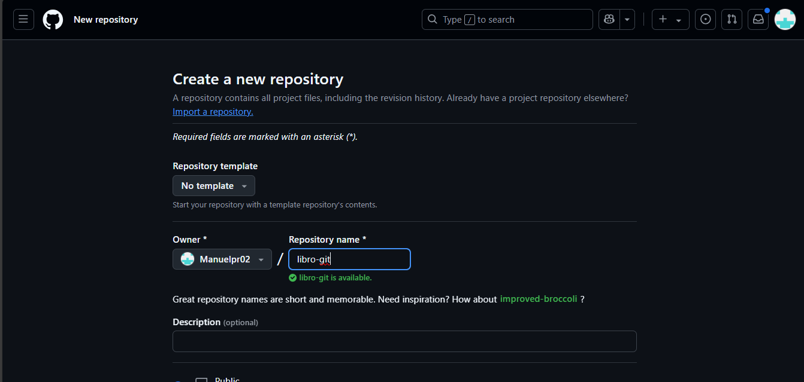  
Se clona el repositorio en libro.  
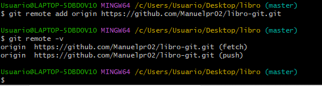  
#### Ejercicio 2
Se sube todo lo de libro haciendo el commit y se comprueba que está subido.  
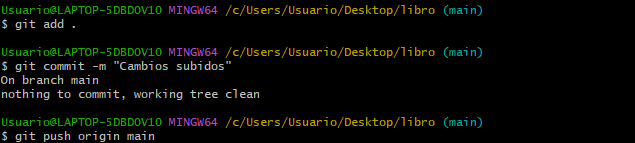  
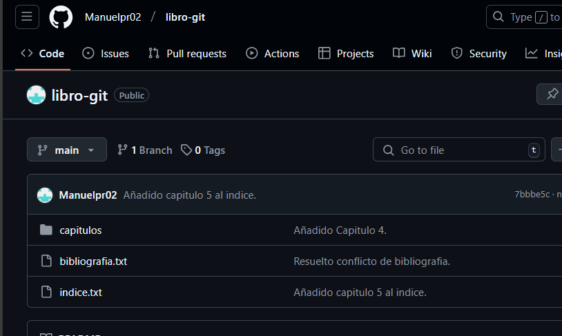  
#### Ejercicio 3
Se clona otro repositorio y se sube este fichero con el nombre y correo del autor.  
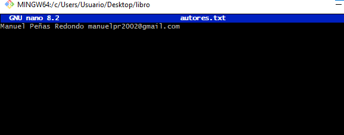  
#### Ejercicio 4
Por último se hace una bifurcación en fork, se clona luego creando la rama auditoria y activandola y modificando el fichero de autores con el nombre para finalmente subirlo todo con el commit.  
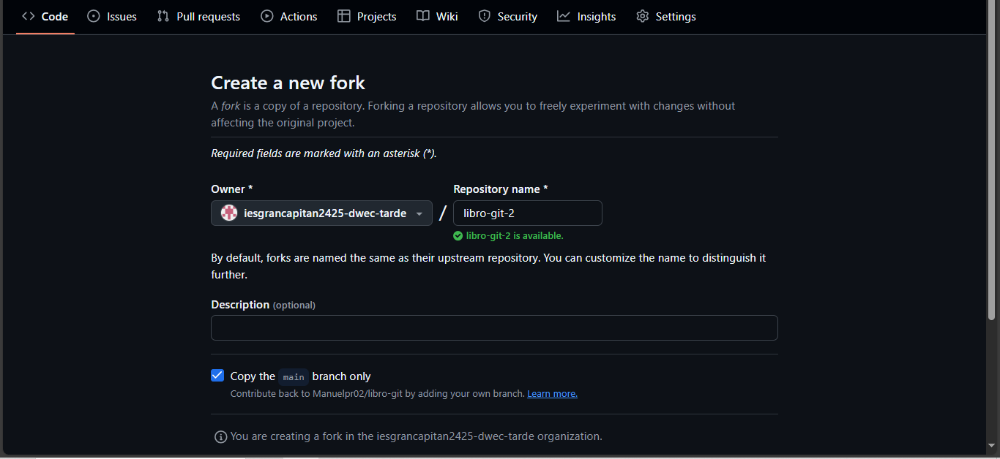  
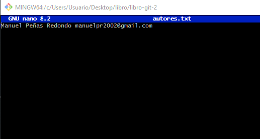  
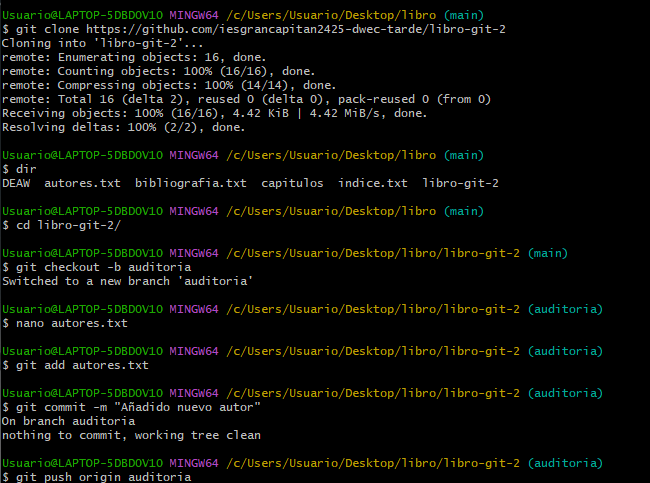  