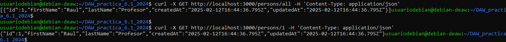

# Práctica 6.1 - Dockerización del despliegue de una aplicación Node.js

## Despliegue con Docker
Lo primero es conectarse por ssh a la máquina virtual.  
  
Se clona el repositorio de la imagen con git clone.  
  
Se instala docker con el comando de la imagen.  
  
Se modifica el dockerfile del repositorio para que quede como en la imagen para poder construir la imagen y correr el contenedor.  
  
Y se procede a hacer build de la imagen con el siguiente comando poniendole el nombre de librodirecciones.  
  
Se le asigna el puerto 3000 con el siguiente comando.  
  
Y se buscamos en el explorador, todavía no sale nada.  
  

## Docker Compose
Lo primero es instalar docker compose si no se tiene. La versión de la imagen es válida.  
  
Se crea un fichero .yml con la siguiente estructura para describir la aplicación.  
  
Se ejecuta lo creado con el comando de debajo para ejecutar las tablas.  
  
Se construye los contenedores con el siguiente comando.  
  
Por último se corren los test para verificar el correcto funcionamiento. 
   
  

## Tarea
Para probar que funciona correctamente la base de datos lo primero es añadir un usuario como el del ejemplo con dicha sentencia.  
  
Se comprueba los usuarios de la base de datos en general primero y luego el que tiene id 1. 
  
Por último se elimina el usuario creado y se muestra que se han eliminado todos.  
  