# Práctica 6.2 - Despliegue de una aplicación PHP con Nginx y MySQL usando Docker y docker-compose

## Proceso de dockerización de Nginx+PHP+MySQL
Lo primero es conectarse por ssh a la máquina.  
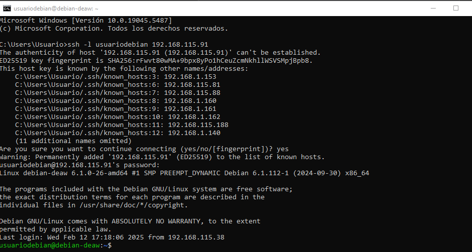  

## Estructura de directorios
Ahora se crea la estructura de directorios creando la carpeta practica6-2 primero y luego con estos comandos.  
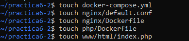  
Deberá quedar así la estructura.  
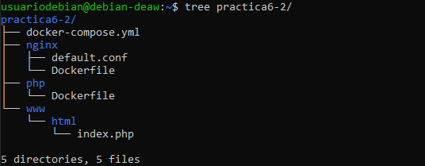  

## Creación de un contenedor Nginx
Para crear el contendero primero se modifica el fichero docker-compose.yml tal que así.  
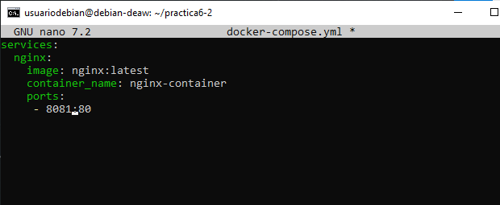  
Se inicia con docker-compose up -d y se comprueba con docker ps.  
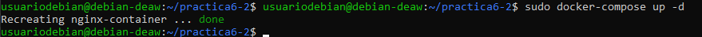  
Y se comprueba que funciona correctamente escribiendo http://IP:Puerto.  
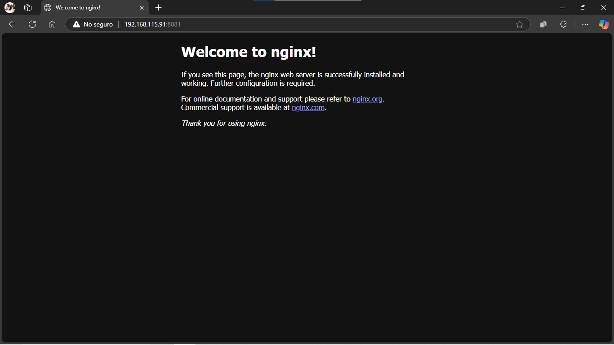  

## Creación de un contenedor PHP
Para el contenedor PHP se modifica el index.php como en la imagen.  
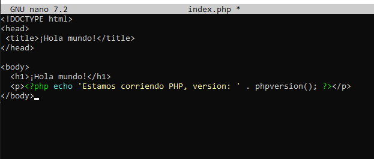  
Luego se modifica el default.conf de la carpeta nginx como en la imagen.  
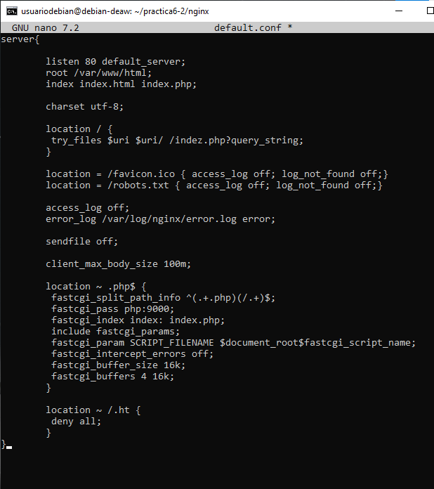  
Y se modifica el Dockerfile de la carpeta nginx.  
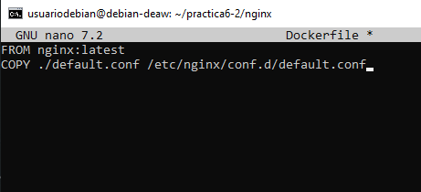
Por último antes de probarlo se vuelve a modificar el docker-compose.yml de nuevo.  
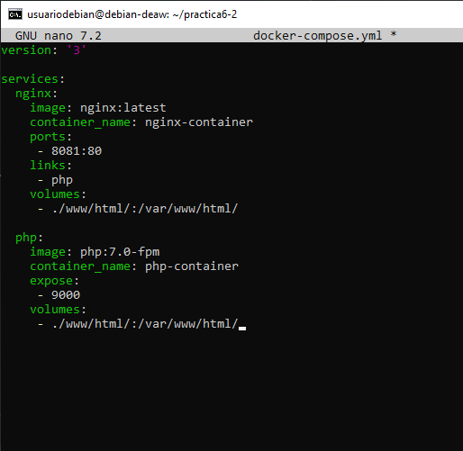  
Se inicia el contenido.  
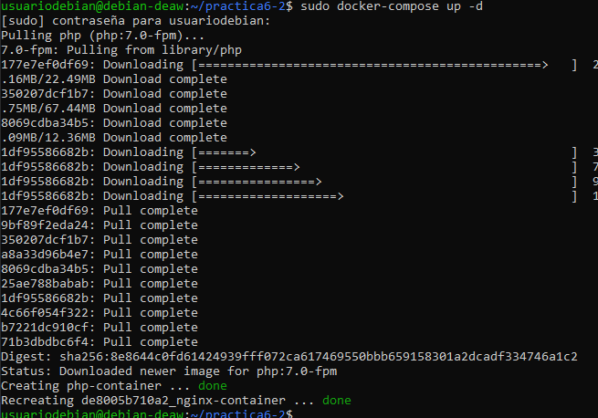  
Se comprueba que funciona.  
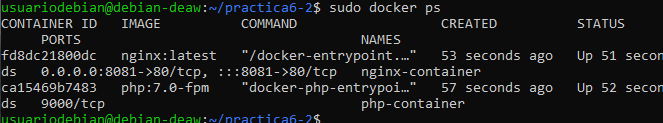  
Se comprueba en el navegador escribiendo http://IP:Puerto.  
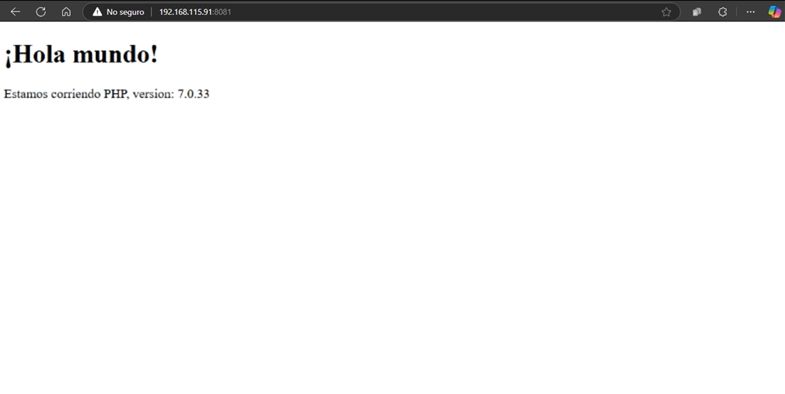  

## Creación de un contenedor para datos
Lo primero es volver a modificar el docker-compose.yml de nuevo.  
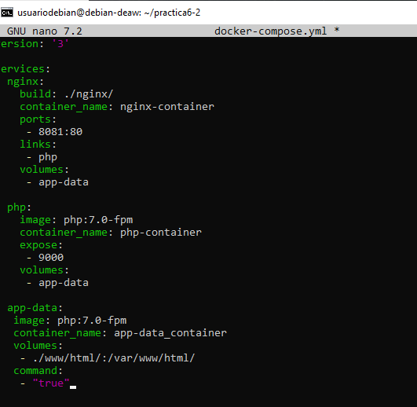  
Se inicia y se comprueba de nuevo antes de crear el contenedor de mysql.   
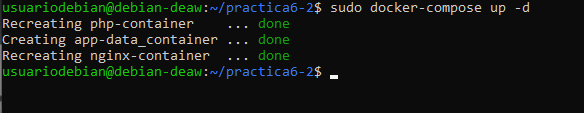  

## Creación de un contenedor MySQL
Lo primero es modificar el dockerfile de la carpeta php.  
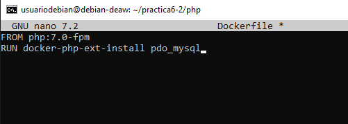  
Se vuelve a modificar el docker-compose.yml.  
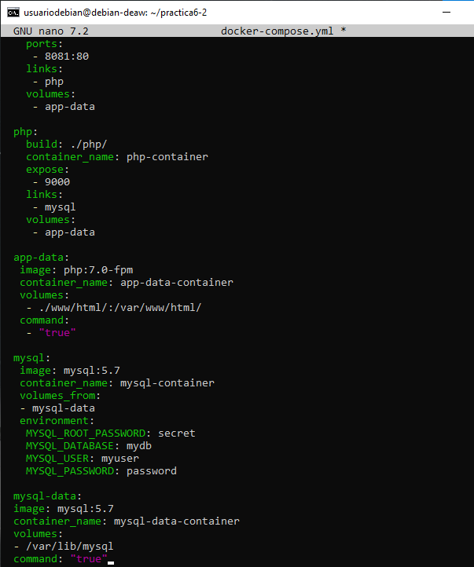  
Se modifica el index.php de nuevo y se inicia el contenedor.  
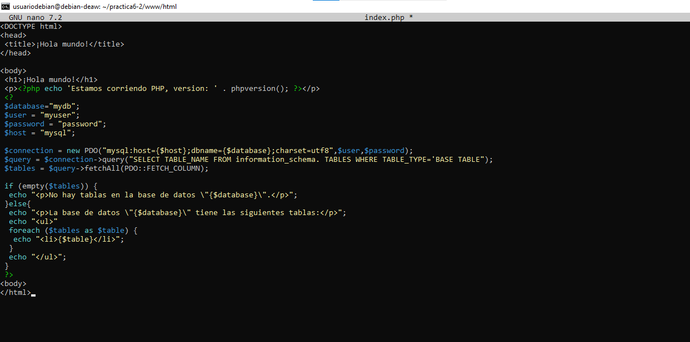  

## Verificación de conexión a la base de datos
Se comprueba en el navegador escribiendo http://IP:Puerto.  
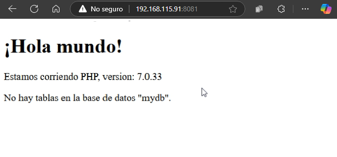  
Para solucionar el error se modifica el index.php añadiendo $user = 'root'; y $password = 'secret';
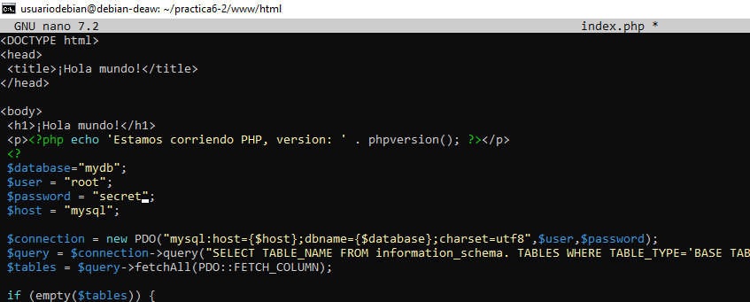  
Se comprueba por última vez en el navegador escribiendo http://IP:Puerto.  
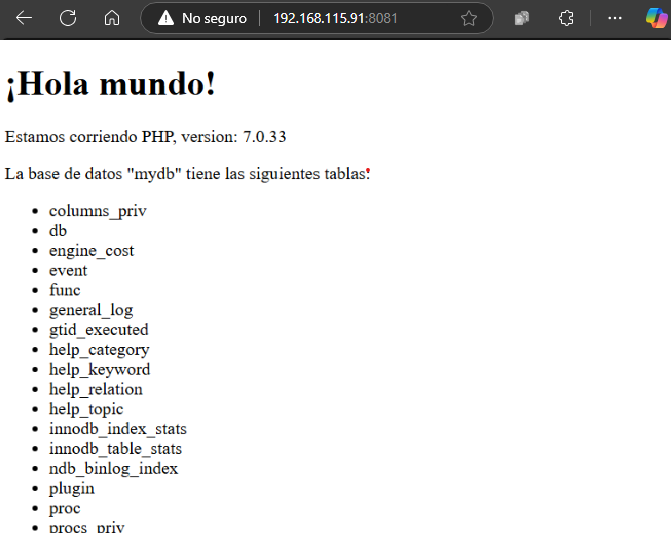  
