# Práctica 6.3 - Despliegue de servidores web con usuarios autenticados mediante LDAP usando Docker y docker-compose

## Despliegue con Docker de NGINX + demonio de autenticación LDAP + OpenLDAP
Lo primero es conectarse por ssh a la máquina.  
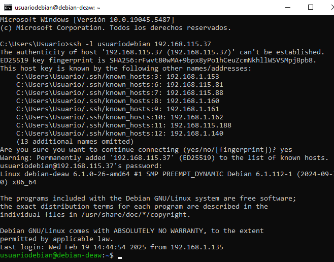  
Luego se crea la carpeta Practica6.3 con la siguiente estructura.  
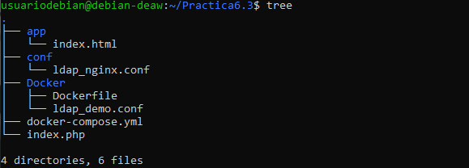  
Se rellena el index.html para que muestre un hola mundo y el archivo ldap_nginx.conf se rellena con el siguiente contenido.  
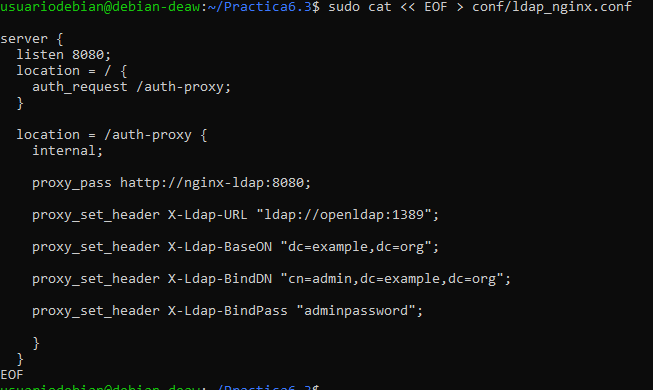  
Por último el docker-compose para poder levantar los contenedores.  
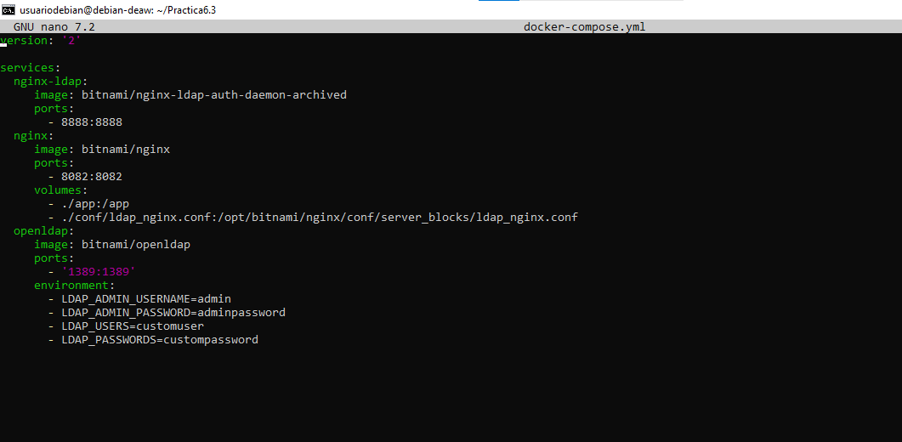  
Se levanta y se comprueba su funcionamiento.  
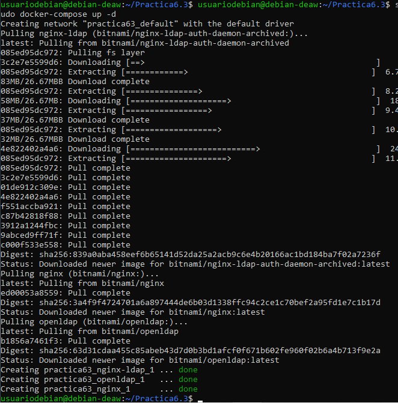  
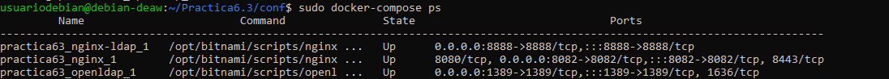  
Por último se comprueba en el explorador escribiendo http://IP:8082. Se registra con los credenciales de antes y ya estaría.  
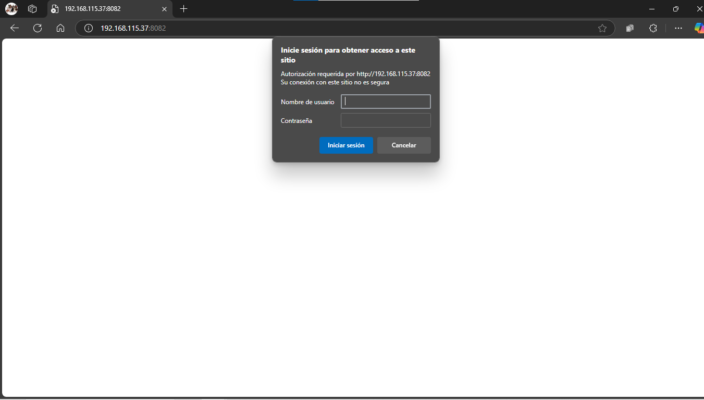  

## Despliegue con Docker de PHP + Apache con autenticación LDAP
Se rellena ahora el archivo index.php con el siguiente contenido.  
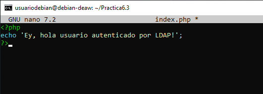  
Se rellena el Dockerfile de la carpeta Docker.  
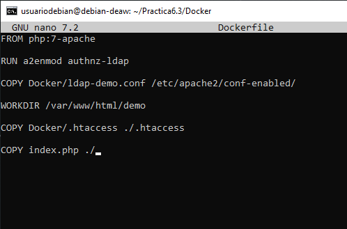  
Se rellena el archivo ldap_demo.conf de la carpeta Docker.  
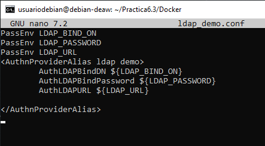  
Se crea un fichero .htaccess para que pida la autentificación.  
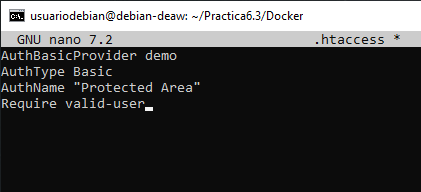  
Se construye ka imagen con el contenido del fichero.  
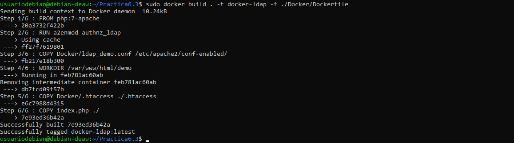  
Se levanta el contenedor con el siguiente comando.  
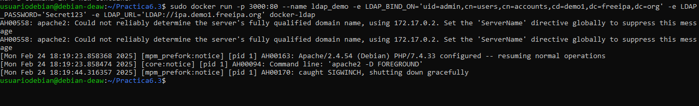  
Por último se comprueba su funcionamiento escribiendo http://IP:3000/demo y después de autentificarse ya estaría terminado.  
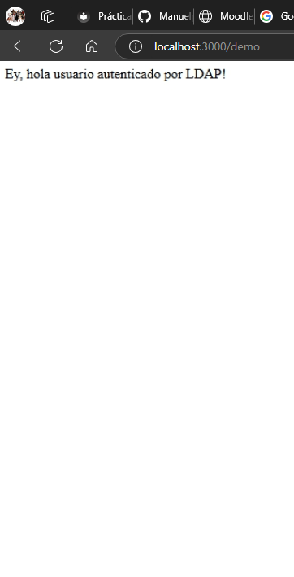  