# Práctica Ampliada

## Instalación de Nginx y preparación.
Lo primero se conecta por ssh a la máquina desde Windows.  
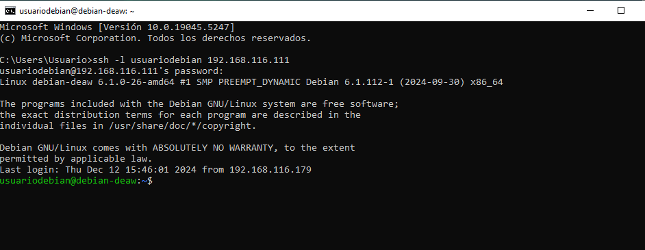
Como ya estaba nginx instalado de prácticas anteriores se comprueba la versión.  
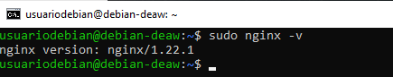

## Creación de usuarios del sistema.
Se procede ahora a la creación de los usuarios con sus contraseñas usando el comando useradd. En este caso los usuarios se llamarán Usuario1 y Usuario2.  
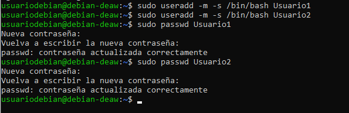

## Estructura de carpetas y archivos.
Dentro de cada usuario se crea una carpeta en home llamada public_html con el comando mkdir.  
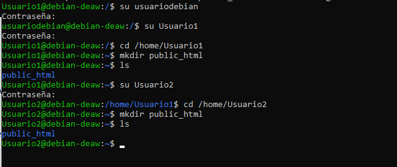
Se le asignan los permisos para que Nginx pueda acceder a ellas con el comando setfacl -d -R -m u:www-data:rw public_html. Se hace en ambas carpetas y se muestra que se ha asignado correctamente con el comando getfacl public_html. 
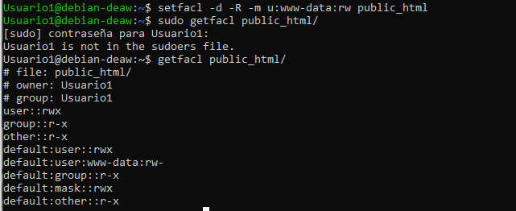
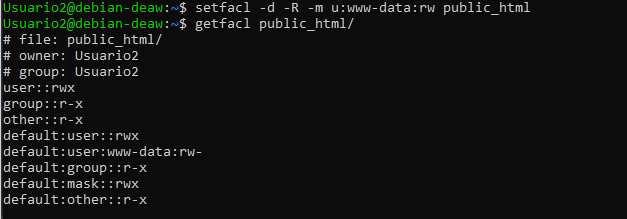
Ahora se crean dos html sencillos en cada carpeta y que sean diferentes. Esto se hace para poder comprobar luego que las páginas web de cada usuario se pueden desplegar.  
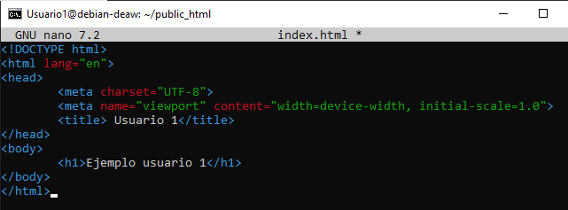
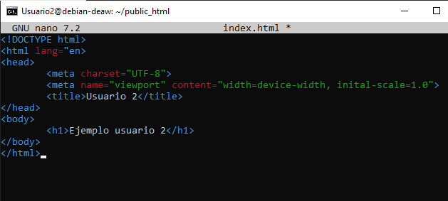

## Creación y configuración de los hosts.
Se crean los certificados a cada usuario mediante el comando openssl req -x509 -newkey rsa:4096 -keyout /etc/ssl/private/usuario.pem -out /etc/ssl/certs/usuario.pem -sha256 -days 365 --nodes, con el nombre de cada usuario.pem.  
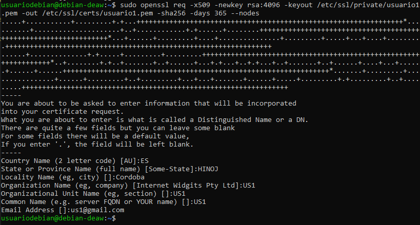
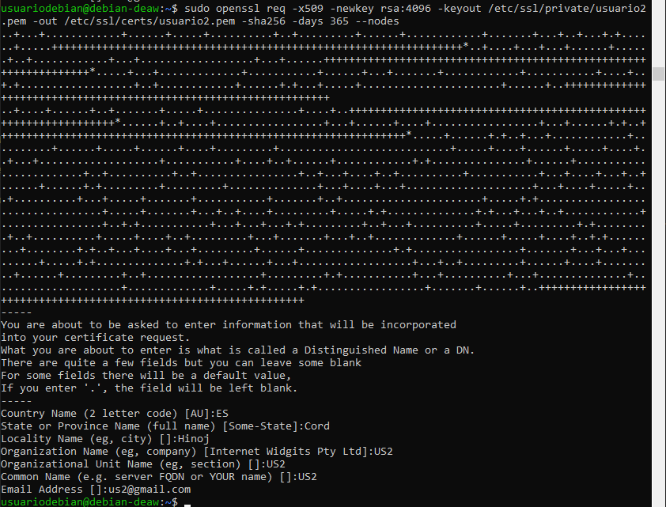

Ahora se crean los archivos de configuración para cada usuario en la carpeta /etc/nginx/sites-available, implementando la conexión segura por HTTPS e indicando el nombre de la página web que habra que buscar.  
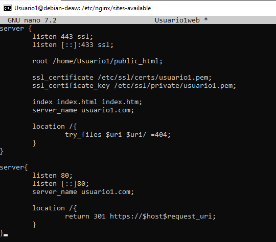
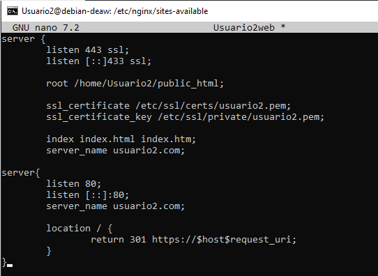

Ahora se crea el enlace simbólico de ambos con la carpeta enabled mediante el comando ln -s /etc/nginx/sites-available/nombreweb /etc/nginx/sites-enabled/nombreweb.  
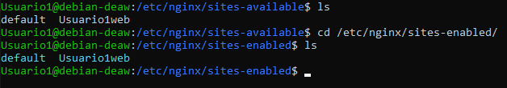
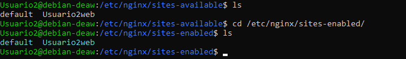

Por último se añade la ip y el nombre de las páginas al archivo host de windows para que puedan buscarse dichas páginas.  
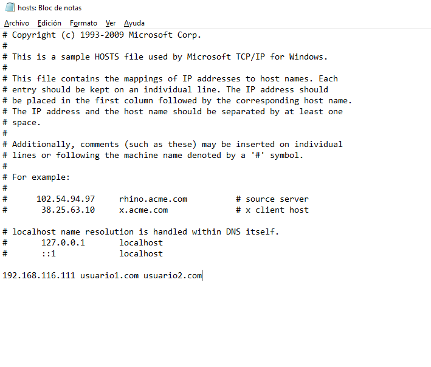

## Comprobación.
Para finalizar la práctica busca ambas páginas web en windows mediante el nombre asignado en el archivo de configuración y se verifica que todo está correcto y funciona.  
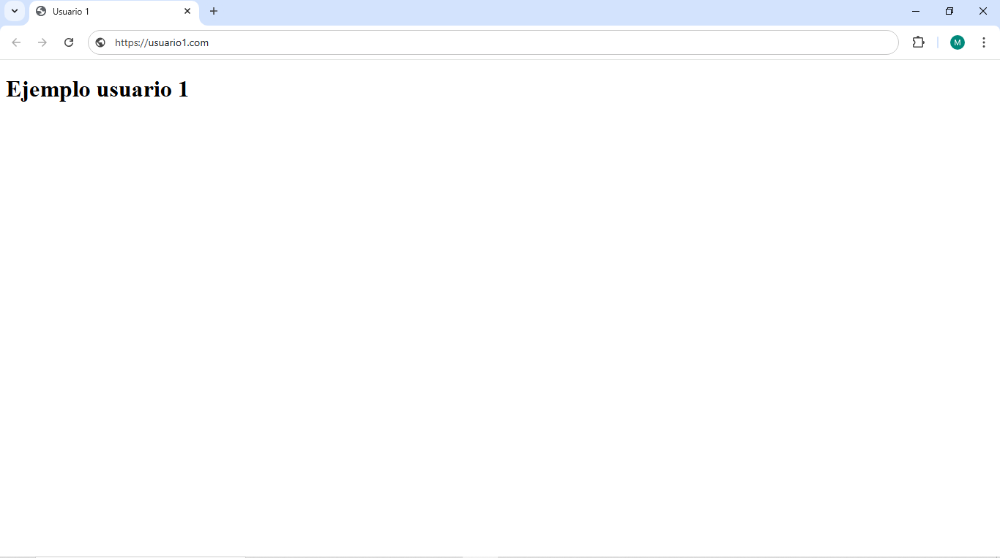
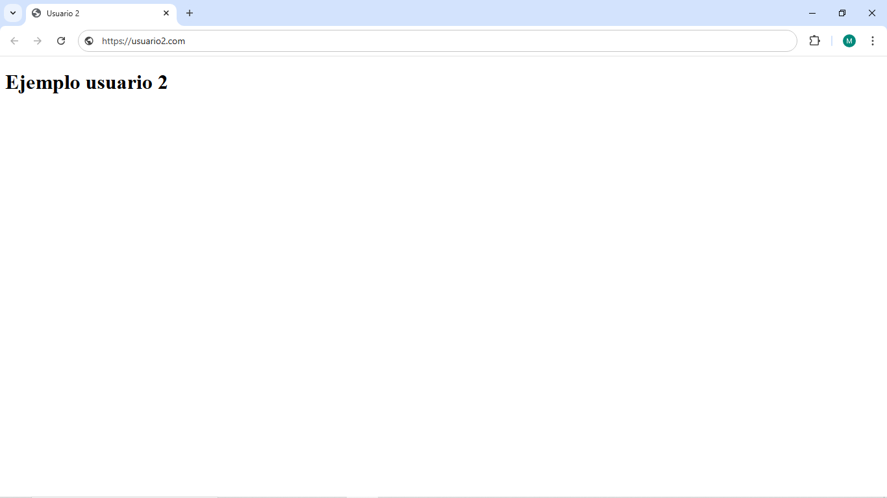